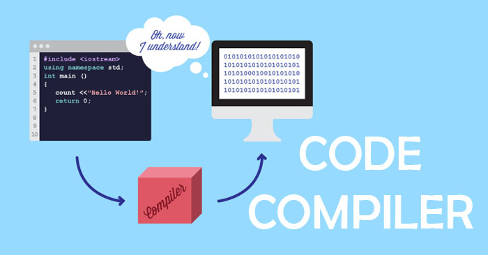
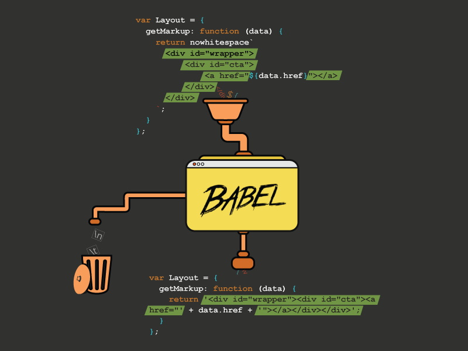
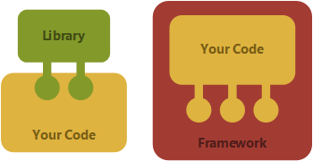
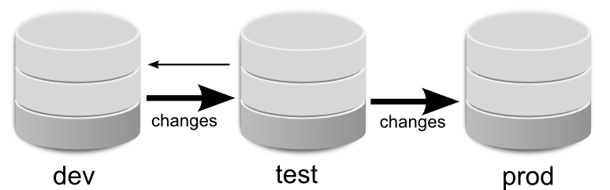
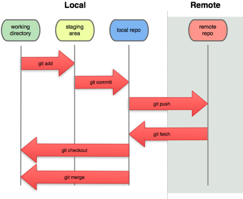

# Clase 1

### Normas y demás
- Puntualidad
- Liquidos y comida
- Ubicación
- Cafeteria, cajeros, farmacias, etc...

### Metodología
- Descansos
- Gestión del curso en GitHub
- Comunicación fuera de clase
- Repositorio común
- Teoría, prácticas y recursos


### Sobre el profesor


**Bio:**
"#JavaScript, #Node, #EmberJS | Profe en [@fictiziaescuela](http://www.fictizia.com/profesores/) | BBVA App Dev"

**Redes Sociales:**
- [Github](https://github.com/josex2r)
- [Linkedin](https://www.linkedin.com/in/josex2r/)


### JavaScript en Acción

- **[Vim eslint Playbulb](https://github.com/josex2r/vim-ale-playbulb)**
  - Correción de código
  - Integración con Vim
  - Bluetooth
  - IoT

- **[Atom toolbar](https://github.com/josex2r/markdown-toolbar)**
  - Plugin de Atom
  - Procesamiento de texto
  - Aplicación escritorio

- **[Gestionar grupos Github mediante Slack](https://github.com/BEEVA-bots-poc/adm-github-org-botkit)**
  - Botkit framework
  - Slack Real Time API
  - Github API
  - Servidor ExpressJS

- **[GoblinDB](GoblinDBRocks.github.io)**
  - Base de datos reactiva
  - Almacenamiento Asíncrono
  - Patrones de diseño (Namespace, Façade, etc...)
  - Ambush Functions, funciones Lambda a demanda
  - Soporte a Eventos

- **[AireMadrid](https://github.com/UlisesGascon/Aire-Madrid)**
  - Arquitectura alternativa en versiones anteriores
  - Conversión y parseo a Json
  - Procesamiento de datos en bruto
  - APIRest
  - Operaciones cíclicas gestionadas por Pillarsjs
  - FrontEnd con Jade
  - BackEnd con Express
  - Documentación con JSDocs
 
- **[Calidad del Aire con Firebase](https://github.com/UlisesGascon/Calidad-del-Aire-con-Firebase)**
  - Manejo de comunicación serial
  - Eventos y asincronía
  - IoT


## Introducción

### Hablemos de la web
- [Evolution of the web](http://www.evolutionoftheweb.com/?hl=es)
- [Internet de los 90](http://theworldsworstwebsiteever.com/)
- [Million dollar page](http://www.milliondollarhomepage.com/)
- [Internet Archive Wayback Machine - La máquina del tiempo](http://archive.org/web/)


### [El largo camino del desarrollador web](https://coggle.it/diagram/52e97f8c5a143de239005d1b/56212c4e4c505e0045c0d3bda59b77e5977c2c9bd40f3fd0b451bdcf8da4aa52)
- Front-End
- Back-End
- Full-Stack
- Dev Ops
- etc...


### JavaScript


> JavaScript (abreviado comúnmente JS) es un lenguaje de programación interpretado, dialecto del estándar [ECMAScript](https://es.wikipedia.org/wiki/ECMAScript). Se define como orientado a objetos, basado en prototipos, imperativo, débilmente tipado y dinámico.

> Se utiliza principalmente en su forma del lado del cliente (client-side), implementado como parte de un navegador web permitiendo mejoras en la interfaz de usuario y páginas web dinámicas aunque existe una forma de JavaScript del lado del servidor (Server-side JavaScript o SSJS). Su uso en aplicaciones externas a la web, por ejemplo en documentos PDF, aplicaciones de escritorio (mayoritariamente widgets) es también significativo. [JavaScript Wikiwand](https://www.wikiwand.com/es/JavaScript)


**Características**
- Multiparadigma
- Imperativo y estructurado
- Dinámico
	- Tipado dinámico
	- Objetual
	- Evaluación en tiempo de ejecución
- Funcional
	- Funciones de primera clase
- Prototípico	
	- Prototipos
	- Funciones constructoras
- Entorno de ejecución
- Funciones como métodos
- Arrays y la definición literal de objetos
- Expresiones regulares

**[ECMA-262](https://www.wikiwand.com/es/ECMAScript)**

- [Tabla de compatibilidad](http://node.green/)
- Versiones:
  - Versión 1 (Junio de 1997)
  - Versión 2 (Junio de 1998)
  - Versión 3 (Diciembre de 1999)
  - Versión 3 (Abandonado)
  - Versión 5 (Diciembre de 2009)
  - Versión 5.1 (Diciembre de 2011)
  - Versión 6 (Junio de 2015) ([funcionalidades](http://es6-features.org/#ArrayMatching))
  - Versión 7 (Junio 2016) ([funcionalidades](https://node.university/blog/498412/es7-es8))
  - Versión 8 (Junio 2017) ([funcionalidades](https://node.university/blog/498412/es7-es8))
  - Versión 9 (2018) ([funcionalidades](https://medium.freecodecamp.org/es9-javascripts-state-of-art-in-2018-9a350643f29c))

- **Compatibilidad:**
	- [ECMA6](https://kangax.github.io/compat-table/es6/)
	- [ECMA5](http://kangax.github.io/compat-table/es5/)
	- [Non-standard](http://kangax.github.io/compat-table/non-standard/)
	- [HTML5 & CSS3](http://fmbip.com/litmus/)
	- [Polyfill](https://www.wikiwand.com/en/Polyfill)

**Compiladores**



- [Coffeescript](http://coffeescript.org/)
- [Typescript](http://www.typescriptlang.org/)
- [NativeScript](https://www.nativescript.org/) 
- [Livescript](http://livescript.net/)

**Transpiladores**



- [Babel](https://babeljs.io/)
- [Traceur](https://github.com/google/traceur-compiler)

**Librería vs Framework**



**Librerías**
- [underscore](http://underscorejs.org/)
- [Jquery](https://jquery.com/)
- [Microjs](http://microjs.com/#)
- [Threejs](http://threejs.org/)
- [D3.js](http://d3js.org/)
- [Modernizr](https://modernizr.com/)
- [Lodash](https://lodash.com/)
- [mustache.js](https://github.com/janl/mustache.js)
- [handlebars.js](http://handlebarsjs.com/)
- [Firebase](http://firebase.com/)

**Frameworks**
- [Angular.js](https://angularjs.org/)
- [Ember.js](http://emberjs.com/)
- [Backbone.js](http://backbonejs.org/)
- [KnockOut.js](http://knockoutjs.com/)
- [React](http://facebook.github.io/react/)
- [Meteor](https://www.meteor.com/)


## Back-end

### Node.js


> Node.js es un entorno en tiempo de ejecución multiplataforma, de código abierto, para la capa del servidor (pero no limitándose a ello) basado en el lenguaje de programación ECMAScript, asíncrono, con I/O de datos en una arquitectura orientada a eventos y basado en el motor V8 de Google. Fue creado con el enfoque de ser útil en la creación de programas de red altamente escalables, como por ejemplo, servidores web. Fue creado por Ryan Dahl en 2009 y su evolución está apadrinada por la empresa Joyent, que además tiene contratado a Dahl en plantilla - [Wikipedia](https://www.wikiwand.com/es/Node.js)

**Otra manera es posible**


**Puntos Fuertes**
- Asincronía (no bloqueo)
- Backend completo
- Gestión de paquetes a través de `npm` (comunidad)
- Single thread (paralelismo)
- Librerías propias
- Utilidades
- Código abierto
- Basado en el V8 (escrito en C++) de Google
- Multiplataforma
- Orientado a Eventos
- **No se limita solo a servidores HTTP**

**Librerías interesantes**
- [Grunt](http://gruntjs.com/)
- [Gulp](http://gulpjs.com/)
- [Express](http://expressjs.com/es/)
- [Mongoose](http://mongoosejs.com/)
- [Socket.io](http://socket.io/)
- [Apache Cordova](http://cordova.apache.org/)
- [Async](https://www.npmjs.com/package/async)
- [Chalk](https://www.npmjs.com/package/chalk)
- [J5](http://johnny-five.io/)
- [GraphicsMagick](http://aheckmann.github.io/gm/)
- [Marked](https://github.com/chjj/marked)
- [Node-restify](https://github.com/restify/node-restify)
- [Webpack](https://github.com/webpack/webpack)
- [Morgan](https://github.com/expressjs/morgan)
- [Nodemailer](https://github.com/nodemailer/nodemailer)
- [Passportjs](http://passportjs.org/)
- [Cheerio](https://github.com/cheeriojs/cheerio)
- [X-ray](https://github.com/lapwinglabs/x-ray)
- [Bower](https://bower.io/)
- [PM2](http://pm2.keymetrics.io/)
- [Electron](http://electron.atom.io/)
- [Yeoman](http://yeoman.io/)
- [Babel](https://babeljs.io/)
- [Helmet](https://www.npmjs.com/package/helmet)
- [Faker](https://www.npmjs.com/package/faker)
- [Protractor](https://www.npmjs.com/package/protractor)
- [Nightwatch.js](http://nightwatchjs.org/)
- [Cypress.io](https://www.cypress.io/)
- [Hubot](https://hubot.github.com/)
- [Botkit](https://www.botkit.ai/)


**Dependencias, dependencias, dependencias... y más dependencias**


*Ejemplo de las dependencias de [ember-cli-workbox](https://github.com/BBVAEngineering/ember-cli-workbox)*

```json
{
 "dependencies": {
    "bower": "^1.8.2",
    "broccoli-funnel": "^1.2.0",
    "broccoli-merge-trees": "^1.2.0",
    "broccoli-plugin": "^1.3.0",
    "ember-cli-babel": "^6.3.0",
    "pretty-bytes": "^4.0.2",
    "rimraf": "^2.6.2",
    "workbox-build": "3.0.0-alpha.3"
  },
  "devDependencies": {
    "broccoli-asset-rev": "^2.4.5",
    "debug": "^3.1.0",
    "ember-ajax": "^3.0.0",
    "ember-cli": "~2.14.2",
    "ember-cli-dependency-checker": "^1.3.0",
    "ember-cli-eslint": "^3.0.0",
    "ember-cli-htmlbars": "^2.0.1",
    "ember-cli-htmlbars-inline-precompile": "^0.4.3",
    "ember-cli-inject-live-reload": "^1.4.1",
    "ember-cli-qunit": "^4.0.0",
    "ember-cli-shims": "^1.1.0",
    "ember-cli-sri": "^2.1.0",
    "ember-cli-uglify": "^2.0.0",
    "ember-disable-prototype-extensions": "^1.1.2",
    "ember-engines": "^0.5.14",
    "ember-export-application-global": "^2.0.0",
    "ember-load-initializers": "^1.0.0",
    "ember-resolver": "^4.0.0",
    "ember-sinon": "^1.0.1",
    "ember-source": "~2.14.1",
    "eslint": "^4.10.0",
    "eslint-config-bbva": "^2.0.0",
    "loader.js": "^4.2.3",
    "mocha": "^4.0.1",
    "broccoli-test-helpers": "0.0.9",
    "chai": "^3.5.0",
    "rimraf": "^2.5.3"
  }
}
```

- [How one developer just broke Node, Babel and thousands of projects in 11 lines of JavaScript](http://www.theregister.co.uk/2016/03/23/npm_left_pad_chaos/)
- [A discussion about the breaking of the Internet](https://medium.com/@mproberts/a-discussion-about-the-breaking-of-the-internet-3d4d2a83aa4d#.r9oqkkuhb)
- [I’ve Just Liberated My Modules](https://medium.com/@azerbike/i-ve-just-liberated-my-modules-9045c06be67c#.mjp6u93c1)
- [Left-pad en GitHub](https://github.com/camwest/left-pad)
- [Is left-pad Indicative of a Fragile JavaScript Ecosystem?](http://developer.telerik.com/featured/left-pad-indicative-fragile-javascript-ecosystem/)
- [Overcoming JavaScript Fatigue](http://developer.telerik.com/topics/web-development/overcoming-javascript-fatigue/)
- [One developer just broke Node, Babel and thousands of projects in 11 lines of JavaScript](https://laravel-news.com/2016/03/one-developer-just-broke-node-babel-thousands-projects-11-lines-javascript/)
- [How 17 Lines of Code Took Down Silicon Valley’s Hottest Startups](http://www.huffingtonpost.com/ken-mazaika/how-17-lines-of-code-took_b_9532846.html)
- [Npm package author revokes his packages, breaking tons of builds](https://evertpot.com/npm-revoke-breaks-the-build/)
- [¿Y si el software Open Source desapareciera?](http://www.xataka.com/servicios/y-si-el-software-open-source-desapareciera)
- [El programador que borró 11 líneas de código y se cargó Internet](http://www.omicrono.com/2016/04/desaparicion-en-node-js-de-left-pad/)

**Cambios, cambios... y más cambios**


- [State of the Art JavaScript in 2017](https://stateofjs.com/)
- [If Loving Computers is Wrong, I Don't Want to Be Right](http://blog.codinghorror.com/if-loving-computers-is-wrong-i-dont-want-to-be-right/)
- [Keeping Up and "Just In Time" Learning](http://blog.codinghorror.com/keeping-up-and-just-in-time-learning/)

**The Magpie Developer**
- [The Magpie Developer](http://blog.codinghorror.com/the-magpie-developer/)

**The Sad State of Web Development**
- [El estado del desarrollo Front-End en 2015 por Ashley Nolan](http://ashleynolan.co.uk/blog/frontend-tooling-survey-2015-results)
- [The Sad State of Web Development](https://medium.com/@wob/the-sad-state-of-web-development-1603a861d29f#.62up3vtl1)
- [A response to The Sad State of Web Development — Its not about Javascript really](https://www.reddit.com/r/programming/comments/40rwrk/a_response_to_the_sad_state_of_web_development/)

### Entorno de desarollo moderno



> La integración continua (continuous integration en inglés) es un modelo informático que consiste en hacer integraciones automáticas de un proyecto lo más a menudo posible para así poder detectar fallos cuanto antes. Entendemos por integración la compilación y ejecución de pruebas de todo un proyecto.

### Git


[Tutorial interactivo](https://try.github.io/levels/1/challenges/1)

> Git es un software de control de versiones pensando en la eficiencia y la confiabilidad del mantenimiento de versiones.

**Trabajo efectivo**

- [Clientes escritorio](https://mac.github.com)
- [Consola (Cheat-sheet)](https://training.github.com/kit/downloads/github-git-cheat-sheet.pdf)
- Repositorio
- Tracking
- Commits
- Sincronizar cambios
- Ramas
- Tags
- Fork
- Clonado
- Pull-request
- Gestión de merges
- Público/Privado

**[Git Flow](http://aprendegit.com/que-es-git-flow/)**


El trabajo se organiza en dos ramas principales:

- **Rama master**: cualquier commit que pongamos en esta rama debe estar preparado para subir a producción
- **Rama develop**: rama en la que está el código que conformará la siguiente versión planificada del proyecto
Cada vez que se incorpora código a master, tenemos una nueva versión.

Además de estas dos ramas, Se proponen las siguientes ramas auxiliares:

- **Feature**: Nuevas funcionalidades que se originan y terminan en la **rama develop**
- **Release**: Ramas listas para pasar a producción que se originan de **develop** y se incorporan en **master** y **develop**
- **Hotfix**: Parches que se aplica sobre **master** y **develop** y que se originan de **master**


**Instalación**

Instalamos [Git - Source Code Management](http://git-scm.com/)

Comprobamos la instalación

```
git --version
```

**Bienvenidos a la maquina del tiempo**
- Arquitectura de Árbol (working area, staging Area, Repository)
- Auditoria de código (quien? cuando? y que?)
- Git trabaja en binario (imagenes, docs, etc...)
- Git no guarda una copia de cada version, solo los cambios.
- Distribución (Repositorios y Clones)
- Opensource y funciona offline
- Consola vs. GUI

**Trabajando en Local**

Configuración (entornos):

[Repositorios locales y remotos](http://media.tumblr.com/tumblr_lbnpoxYtNm1qaku05.png)


- System (todos los usuarios)
    - `git config --system`
    - `etc/gitconfig`, `/usr/local/git/etc/gitconfig`

- Global (mi usuario)
    - `git config --global`
    - `.gitconfig` (usuario/root)

- Project (proyecto)
    - `git config`
    - `/proyect/.git/config`

**Comandos básicos**

versión
```
git --version
```

Grabando Nombre
```
git config --global user.name "nombre"
```

Comprobando el nombre
```
git config --global user.name
```

Grabando Email
```
git config --global user.email "email"
```

Habilitando colores
```
git config --global color.ui true
```

Ver usuarios en el equipo
```
git config --global --list
```

**GIT Working flow (local) - Básico**

- help (ayuda)

    - Ayuda general
    ```
    git config --global --list
    ```

    - Ayuda especifica
    ```
    git help push
    ```

    - Salir de la ayuda
    ```
    q (quit)
    ```

- init (arranque)
    - Buscamos la carpeta (ls, dir...)
    - Arrancando Git
    ```
    git init
    ```

- status
    - Verificar estado
    ```
    git status
    ```

- add
    - Añadiendo todo
    ```
    git add -A
    ```

    - Añadiendo todo *(como add -A, pero omite los archivos fuera de track)*
    ```
    git add .
    ```

    - Añadiendo un archivo especifico
    ```
    git add loquesea
    ```

- commit
    - Comentando el commit
    ```
    git commit -m "Mi primer commit"
    ```

- log
    - Verificando el estado de los commits
    ```
    git log
    ```

- reset (Reseteamos el proyecto hasta un punto dado (SIN RETORNO!))
    - No afecta al working area ni al Stagging Area, solo al repositorio
    ```
    git reset --soft NUMEROCOMMIT
    ```

    - No afecta al working area
    ```
    git reset --mixed NUMEROCOMMIT
    ```

    - Afecta a todos los niveles incluido el working area
    ```
    git reset --hard NUMEROCOMMIT
    ```

    - En caso de necesitar recuperación.
    Haz un reset --hard hacia delante, con el número del útimo commit.
    ```
    git reset --hard ULTIMOCOMMIT
    ```

    - Devolver un archivo de staging a working area
    ```
    git reset HEAD nombrearchivo
    ```    


**GIT Working flow (local) - Viajar en el tiempo**

- log
    - Hacemos una copia de seguridad de nuestros commits.
    ```
    git log > miscommits.txt
    ```

- checkout

    - Abrimos la maquina de tiempo
    ```
    git checkout NUMEROCOMMIT
    ```

    - Volvemos a Master
    ```
    git checkout master
    ```


**GIT Working flow (local) - Ramas (Branches)**

Ramas (Universos Paralelos)
*Línea master -> linea estable o principal.*
*Lineas secundarias -> lineas de desarrollo, bugs, experimentos, etc...*

- branch

    - Crear una rama
    ```
    git branch NOMBRERAMA
    ```

    - Ver ramas
    ```
    git branch
    ```    

    - Cambiar de rama
    ```
    git checkout NOMBRERAMA
    ```  

    - Ver cambios en formato ramas
    ```
    git log --oneline --graph --all
    ```  

    - Borrar una rama
    ```
    git branch -d NOMBRERAMA
    ```


**GIT Working flow (local) - Fusiones (básico)**

- Nos situamos en la rama que absorberá (principal)
    ```
    git checkout RAMAPRINCIAL
    ```

- Hacemos el *merge*
    ```
    git merge RAMASECUNDARIA
    ```

- Añadir comentario (o)

- Guardar y salir (:x)

- Ramas fusionadas
    ```
    git branch
    ```

- Borramos rama
    ```
    git branch -d NOMBRERAMA
    ```


**GIT Working flow (local) - Fusiones (gestión conflictos)**

  - Fast-forward (automatizado). No hay conflicto alguno.

    - Nos situamos en la rama que absorberá (principal)
    ```
    git checkout RAMAPRINCIAL
    ```

    - Hacemos el MERGE
    ```
    git merge RAMASECUNDARIA
    ```

    - Añadir comentario (o)

    - Guardar y salir (:x)


  - Manual Merge (Conflicto, dos personas tocaron los mismos archivos)

    - Nos situamos en la rama que absorberá (principal)
    ```
    git checkout RAMAPRINCIAL
    ```

    - Hacemos el MERGE
    ```
    git merge RAMASECUNDARIA
    ```

    - En consola
    ```
    Auto-merging CARPETA/ARCHIVO
    CONFLICT (content): Merge conflict in CARPETA/ARCHIVO
    Automatic merge failed; fix conflicts and then commit the result.
    ```

    - En el editor
    ```
    <<<<<<< HEAD
    hello world....!!!!!!!
    =======
    hello world 2 ..!!!
    >>>>>>> conflictiva
    ```

    - Resuelver y guardar
    ```
    hello world 2 ..!!!
    ```

    - Comprobamos el estado
    ```
    git status
    ```

    - commit para la resolución conflicto
    ```
    git commit -am "con este commit se arregla el conflicto"
    ```

    - Resultado
    ```
    *   81a6c1d con este commit se arregla el conflicto
    |\  
    | * 64b5518 que pasa
    * | 29a6348 ahora conflcito..no
    |/  
    * afe16ae Todo arriba..
    * 7c9cc50 Mi primer Commit
    ```

    - Borramos la rama (opcional)
    ```
    git branch -d NOMBRERAMA
    ```


**GITHUB Working flow (básico)**
  - clone
    - Clonar un proyecto ( [Bootstrap](https://github.com/twbs/bootstrap) )
    ```
    git clone https://github.com/twbs/bootstrap.git
    ```

  - log
    - Mirar los commits
    ```
    git log
    ```    


**GITHUB Working flow (Proyecto desde cero)**

  - Creamos los ficheros

  - init
    - monitorizamos los ficheros
    ```
    git init
    ```

  - commit
    - Añadimos los ficheros en un commit
    ```
    git commit -am "Mi primer proyecto"
    ```

  - remote
    - Enlazamos con Github
    ```
    git remote add origin <--HTTPoSSH-->
    ```

    - Comprobamos los detalles
    ```
    git remote -v
    ```

  - push
    - Mandamos los cambios
    ```
    git push origin master
    ```

**GITHUB Working flow (Proyecto en equipo)**
El proceso es igual, pero es necesario mantenerse sincronizado.

  - fetch
    - Actualizar *origin/master* (rama espejo en local)
    ```
    git fetch origin
    ```

  - merge
    - Fusionar *master* con *origin/master*
    ```
    git merge origin/master
    ```

  - commit
    - Preparamos un *commit* para subir un cambio a Github
    ```
    git commit -am "Nuevo cambio"
    ```

  - push
    - Subimos los cambios
    ```
    git push origin master
    ```


**GITHUB Working flow (Proyectos de terceros)**
*Usamos 2 repositorios (ORIGINAL EXTERNO (upstream/master) -> CLON ORIGINAL (origin/master) -> CLON LOCAL)*

  - remote
    - Conectamos al fork (origin)
    ```
    git remote add origin <--- HTTP --->
    ```

    - Verificamos la conexión
    ```
    git remote -v
    ```

    - Conectamos al remoto *(Upstream)*
    ```
    git remote add upstream HTTTPREPO-UPS
    ```

    - Verificamos que tenemos dos enlaces *(origin y upstream)*
    ```
    git remote -v
    ```

  - fetch
    - Comprobamos cambios en *origin*
    ```
    git fetch origin
    ```

    - Comprobamos cambios con *upstream*
    ```
    git fetch upstream
    ```

  - merge
    - Fusionamos *upstream* con local para actualizarnos
    ```
    git merge upstream/master
    ```

  - push
    - Subimos cambios a *origin*
    ```
    git push origin master
    ```

  - Subimos cambios al *upstream (pull-request)*


**GITHUB Working flow (GitHub Pages Manual)**
GitHub Pages nos permite hacer una web estática para nuestro usuario o proyectos

  - clone
    - Clonamos el repositorio
    ```
    git clone <-- URL.git -->
    ```

  - checkout --orphan
    - Creamos una rama huérfana
    ```
    git checkout --orphan gh-pages
    ```

  - rm
    - Borramos todos los archivos del directorio
    ```
    git rm --rf .
    ```

  - add
    - Creamos nuestro index.html y lo añadimos
    ```
    echo "Bienvenido a gh-pages" > index.html
    git add index.html
    ```

  - commit
    - Preparamos un commit para subir el index a Github
    ```
    git commit -am "Nuevo cambio"
    ```

  - push
    - Subimos el cambio
    ```
    git push origin gh-pages
    ```


**GITHUB Avanzado (Trucos)**


  - branch
    - Renombrar rama
    ```
    git branch -m NOMBRERAMA NOMBRERAMANUEVO
    ```

    - Mostrando todas las ramas (incluido espejos)
    ```
    git branch -a
    ```

  - add + commit
    - am
    ```
    git commit -am "Texto"
    ```

  - config
    - Usando un alias
    ```
    git config --global alias.NOMBREALIAS 'COMANDO'
    git config --global alias.buenlog 'log --oneline --graph --all'
    git buenlog
    ```

  - pull
    - fecht + merge
    ```
    git pull
    ```

  - diff
    - Ver lo que has modificado pero aún no has preparado
    ```
    git diff
    ```

    - Ver los cambios que has preparado y que irán en tu próxima confirmación
    ```
    git diff --cached
    ```


### Github


- [Socializacion](https://guides.github.com/activities/socialize/)
	- Perfil
- Timeline Actividad
- [Colaborar](https://guides.github.com/activities/contributing-to-open-source/)
- [Compartir](https://guides.github.com/introduction/getting-your-project-on-github/)
- [Gist](https://gist.github.com/)
- [Issues](https://guides.github.com/features/issues)
- [Pages](https://guides.github.com/features/pages/)
- [Wikis](https://guides.github.com/features/wikis)


### [Cloud9](https://aws.amazon.com/cloud9/)


**Características estrella**
- Code together in real time
- Share your IDE, your workspace, a preview, or your running app
- Replay all edits and see your code at any point in time
- AWS integration

**Otras características**
- Preview in any browser
- Built-In Terminal
- Language Tools
- Debugger
- Split View
- Themes
- Run Panel
- Key Bindings Editor
- VIM/Emacs/Sublime Mode
- Built-In Image Editor

**Más**
- [Precios y planes](https://aws.amazon.com/cloud9/pricing/)
- [Getting started](https://aws.amazon.com/cloud9/getting-started/)
- [c9 en GitHub](https://github.com/c9)


### Trabajando con C9.io

- [Setup Git and basic commands](http://git-scm.com/book/es/v1/Empezando-Configurando-Git-por-primera-vez)

**Escenarios básicos:**

**Quiero subir algo a Github**

1. Verificamos el estado en general.
 ```
git status
 ```

2. Nos actualizamos.
 ```
git pull
 ```

3. Preparamos nuestro commit (añadimos archivos y añadimos la información adicional)
 ```
git add "ARCHIVO" 
git commit -m "MENSAJE..."
 ```

4. Actualizamos y enviamos los cambios a Github
 ```
git pull && git push
 ```

**No quiero subir nada a Github, pero quiero estar actualizado**

1. Nos actualizamos.
 ```
git pull
 ```

**Trucos:**

- Para cachear las credenciales y evitar que nos pida usuario y contraseña constantemente:

```
git config --global credential.helper 'cache --timeout=9999999'
```
Git cacheará la sesión y no os preguntará el usuario o la password durante 9999999ms (2,7h), o el tiempo que pidamos.
Recuerda que debes incluir este comando antes de tu próximo *git push*


### Resumen

[tamaño original](http://www.geekgumbo.com/wp-content/uploads/2011/08/nvie-git-workflow-commands.png)


## Reintroducción a Javascript

### Linters

#### JSHint
- [JSHint Online](http://jshint.com/)
- [JSHint About](http://jshint.com/about/)
- [JSHint Repository](https://github.com/jshint/jshint)

#### EsLint

- [Demo](http://eslint.org/demo/)
- [Configuring ESLint](http://eslint.org/docs/user-guide/configuring)
- [Command Line Interface](http://eslint.org/docs/user-guide/command-line-interface)
- [Rules](http://eslint.org/docs/rules/)
- [Formatters](http://eslint.org/docs/user-guide/formatters/)

### [Repaso de Javascript](./javascript.md)

En el fichero [./javascript.md](./javascript.md) están las funcionalidades básicas de javascript.

- [Consola](./javascript.md#consola)
- [Caracteres especiales](./javascript.md#caracteres-especiales)
- [Comentarios](./javascript.md#comentarios)
- [Variables](./javascript.md#variables)
- [Tipos de variables](./javascript.md#tipos-de-variables)
- [Matemáticas básicas](./javascript.md#matemáticas-básicas)
- [Operadores](./javascript.md#consola)
- [Interacción con el usuario](./javascript.md#interacción-básica-con-el-usuario)
- [Modo Estricto](./javascript.md#modo-estricto)
- [Comparadores](./javascript.md#comparadores-básicos)
- [Condicionales](./javascript.md#if-else)
- [Bucles](./javascript.md#while)
- [Números](./javascript.md#números)
- [Strings](./javascript.md#string)
- [Arrays](./javascript.md#arrays)
- [Objetos](./javascript.md#objetos)
- [Funciones](./javascript.md#funciones)
- [Promesas](./javascript.md#promesas)
- [Prototipo](./javascript.md#prototipo)

### Otras features útiles

**Variables**

- Mediante `var` definimos una variable con **local scope**, permite utilizar [hoisting](https://developer.mozilla.org/es/docs/Glossary/Hoisting) y [shadowing](https://en.wikipedia.org/wiki/Variable_shadowing).
- Utilizando `let` definimos variable con **block scope**, no permite **hoisting**.
- Con `const` definimos variables de sólo lectura (no confundir con inmutables).

**Arrow functions**

- Con contenido

```javascript
const test = () => {
  // Código js
};
```

- Return directo

```javascript
const test = () => 'hola';
test() === 'hola' ; // true
```

- Contexto implícito (no cambia el valor de `this`)

```javascript
const self = this;
const test = () => self === this;
test(); // true
```

**Parámetros por defecto en funciones**

```javascript
function repeat(name = 'Jose') {
 console.log(name);
}

repeat(); // 'Jose'
repeat('Nadie'); // 'Nadie'
```

**Parámetro `rest`** (`rest operator`)

Permite definir un array con el resto de parámetros que aparezcan en la función.

```javascript
function showRest(a, ...rest) {
 console.log(rest);
}

showRest(); // []
showRest(1); // []
showRest(1, 2, 3, 4); // [2, 3, 4]
```

**Operador de expansión** (`spread operator`)

Permite expandir una colección iterable (ej. array, string, ...) como argumentos de una función o de otra colección.

```javascript
const numbers = [1, 2, 3, 4];
const moreNumbers = [0, ...numbers, 5, 6, 7];

console.log(...numbers); // 1 2 3 4
console.log(moreNumbers); // [0, 1, 2, 3, 4, 5, 6, 7]
```

**Template literals**

Permiten la creación de cadenas de texto multilínea, así como la sustitución de variables en tiempo de ejecución.

```javascript
const name = 'Jose';

console.log(`Mi nombre es ${name}`); // 'Mi nombre es Jose'
```

**Atajos al definir propiedades** (`property shorthand`)

Cuando el nombre de la propiedad de un objeto coincide con el nombre de la variable podemos ahorrarnos la asignación.

```javascript
const name = 'Jose';
const person = { name };

console.log(person.name); // 'Jose'
```

**Notación de método en objetos**

```javascript
const person = {
  getName() {
    return 'Jose';
  }
};

console.log(person.getName()); // 'Jose'
```

**Nombres de propiedades dinámicos** (`computed properties`)

```javascript
const name = 'Name';
const person = {
  [`get${name}`]() {
    return 'Jose';
  }
};

console.log(person.getName()); // 'Jose'
```

**Asignación por desestructuración** (`destructuring`)

- En arrays

  ```javascript
  const numbers = [1, 2, 3];
  const [a, , c] = numbers;
  
  console.log(a); // 1
  console.log(c); // 3
  ```

- En objetos

  ```javascript
  const numbers = {
   a: 1,
   b: 2,
   c: 3
  };
  const { a, c } = numbers;
  
  console.log(a); // 1
  console.log(c); // 3
  ```

- Con valores por defecto

  ```javascript
  const numbers = {};
  const { noExist = 9 } = numbers;
  
  console.log(noExist); // 9
  ```

- Como argumento de una función

  ```javascript
  function repeat([name]) {
   console.log(name);
  }
  
  repeat(['Jose']); // 'Jose'
  ```

  ```javascript
  function repeat({ name }) {
   console.log(name);
  }
  
  repeat({ name: 'Jose' }); // 'Jose'
  ```

**Clases**

- Definición

  ```javascript
  class Animal {
    constructor(name) {
      this.name = name;
    }
    talk() {
      console.log(`My name is ${this.name}`);
    }
  }
  
  const dog = new Dog('Eddie');
  dog.talk(); // 'My name is Eddie'
  ```

- Herencia

  ```javascript
  class Dog extends Animal {
    constructor(name) {
      super(name);
      this.family = 'Dog';
    }
    talk() {
      super.talk();
      console.log(`My family is ${this.family}`);
    }
  }
  
  const dog = new Dog('Eddie');
  dog.talk();
  // 'My name is Eddie'
  // 'My family is Dog'
  ```

- Getters y Setters

  ```javascript
  class Person {
    get name() {
      return this._name || 'No name';
    }
    
    set name(value){
      this._name = value;
    }
  }
  
  const me = new Person();
  console.log(me.name); // 'No name'
  me.name = 'Jose';
  console.log(me.name); // 'Jose'
  ```

**Async + Await**

```javascript
async function getGithubUser(username) {
  const url = `https://api.github.com/users/${username}`;
  const response = await fetch(url);
  const json = await response.json();
 
  return json;
}

// Forma asíncrona
(async function() {
  const userData = await getGithubUser('josex2r');
 
  console.log(userData); // { login: "josex2r", id: 3719730, ... }
})();

// Utilizando promesas
getGithubUser('josex2r').then((userData) => {
  console.log(userData); // { login: "josex2r", id: 3719730, ... }
})
```
**For...in**

Itera sobre todas las propiedades de un objeto, en un orden arbitriario.

```javascript
var objeto1 = {
  propiedad1: "hola",
  propiedad2: 2,
  propiedad3: false,
  propiedad4: [true,2,5, "..."],
  propiedad5: {
  	 dato: "más datos..."
  },
  metodo: function(){
  	 console.log("hola");
  }
}
function mostrar_propiedades(objeto, nombreObjeto) {
  var resultado = "";
  for (var i in objeto) {
    resultado += nombreObjeto + "." + i + " = " + objeto[i] + "\n";
  }
  return resultado;
}

mostrar_propiedades(objeto1, "objeto1");
```

**Generadores**

```javascript
function *fibonacci (numbers) {
    let pre = 0;
    let cur = 1;
    while (numbers-- > 0) {
        [ pre, cur ] = [cur, pre + cur];
        yield cur;
    }
}

for (let n of fibonacci(1000)) {
  console.log(n);
}
```

## Ejercicios

**1 -** [Try git!](https://try.github.io)

**2 -** [Arregla todos los errores de eslint](https://eslint.org/demo/#eyJ0ZXh0IjoiLy8gQXJyYXkubWFwIHBvbHlmaWxsXG5pZiAoQXJyYXkucHJvdG90eXBlLm1hcCA9PT0gdW5kZWZpbmVkKSB7XG5cblxuICBBcnJheS5wcm90b3R5cGUubWFwID0gZnVuY3Rpb24oZm4pIHtcblx0dmFyIHJ2ID0gW10sIGk9MFxuICAgIGZvcih2YXIgaT0wLCBsPXRoaXMubGVuZ3RoOyBpPGw7IGkrKylcbiAgICAgIHJ2LnB1c2goZm4odGhpc1tpXSkpO1xuICAgIHJldHVybiAgcnZcbiAgfTtcbn0iLCJvcHRpb25zIjp7InBhcnNlck9wdGlvbnMiOnsiZWNtYVZlcnNpb24iOjYsInNvdXJjZVR5cGUiOiJzY3JpcHQiLCJlY21hRmVhdHVyZXMiOnt9fSwicnVsZXMiOnsiY29uc3RydWN0b3Itc3VwZXIiOjIsIm5vLWNhc2UtZGVjbGFyYXRpb25zIjoyLCJuby1jbGFzcy1hc3NpZ24iOjIsIm5vLWNvbXBhcmUtbmVnLXplcm8iOjIsIm5vLWNvbmQtYXNzaWduIjoyLCJuby1jb25zb2xlIjoyLCJuby1jb25zdC1hc3NpZ24iOjIsIm5vLWNvbnN0YW50LWNvbmRpdGlvbiI6Miwibm8tY29udHJvbC1yZWdleCI6Miwibm8tZGVidWdnZXIiOjIsIm5vLWRlbGV0ZS12YXIiOjIsIm5vLWR1cGUtYXJncyI6Miwibm8tZHVwZS1jbGFzcy1tZW1iZXJzIjoyLCJuby1kdXBlLWtleXMiOjIsIm5vLWR1cGxpY2F0ZS1jYXNlIjoyLCJuby1lbXB0eS1jaGFyYWN0ZXItY2xhc3MiOjIsIm5vLWVtcHR5LXBhdHRlcm4iOjIsIm5vLWVtcHR5IjoyLCJuby1leC1hc3NpZ24iOjIsIm5vLWV4dHJhLWJvb2xlYW4tY2FzdCI6Miwibm8tZmFsbHRocm91Z2giOjIsIm5vLWZ1bmMtYXNzaWduIjoyLCJuby1nbG9iYWwtYXNzaWduIjoyLCJuby1pbm5lci1kZWNsYXJhdGlvbnMiOjIsIm5vLWludmFsaWQtcmVnZXhwIjoyLCJuby1pcnJlZ3VsYXItd2hpdGVzcGFjZSI6Miwibm8tbmV3LXN5bWJvbCI6Miwibm8tb2JqLWNhbGxzIjoyLCJuby1vY3RhbCI6Miwibm8tcmVkZWNsYXJlIjoyLCJuby1yZWdleC1zcGFjZXMiOjIsIm5vLXNlbGYtYXNzaWduIjoyLCJuby1zcGFyc2UtYXJyYXlzIjoyLCJuby10aGlzLWJlZm9yZS1zdXBlciI6Miwibm8tdW5leHBlY3RlZC1tdWx0aWxpbmUiOjIsIm5vLXVucmVhY2hhYmxlIjoyLCJuby11bnNhZmUtZmluYWxseSI6Miwibm8tdW5zYWZlLW5lZ2F0aW9uIjoyLCJuby11bnVzZWQtbGFiZWxzIjoyLCJuby11bnVzZWQtdmFycyI6Miwibm8tdXNlbGVzcy1lc2NhcGUiOjIsInJlcXVpcmUteWllbGQiOjIsInVzZS1pc25hbiI6MiwidmFsaWQtdHlwZW9mIjoyLCJuby12YXIiOjIsImNvbW1hLWRhbmdsZSI6Miwibm8tZXh0cmEtc2VtaSI6Miwic2VtaSI6Miwibm8tbWl4ZWQtc3BhY2VzLWFuZC10YWJzIjoyLCJuby1tdWx0aS1zcGFjZXMiOjIsIm5vLW11bHRpcGxlLWVtcHR5LWxpbmVzIjoyLCJvbmUtdmFyLWRlY2xhcmF0aW9uLXBlci1saW5lIjoyLCJuZXdsaW5lLWFmdGVyLXZhciI6MiwibmV3bGluZS1iZWZvcmUtcmV0dXJuIjoyLCJzcGFjZS1pbi1wYXJlbnMiOjIsInNwYWNlLWJlZm9yZS1ibG9ja3MiOjIsInNwYWNlLWJlZm9yZS1mdW5jdGlvbi1wYXJlbiI6Miwic3BhY2UtaW5maXgtb3BzIjoyfSwiZW52Ijp7InBoYW50b21qcyI6ZmFsc2UsIm5hc2hvcm4iOmZhbHNlfX19 ) ([Solución](https://gist.github.com/josex2r/dd2e6156d9047fa1e5a4973ddc2cd4ee))

**3 -** Entra en Cloud9 y prepara el IDE para realizar los siguientes ejercicios.

**4 -** Sube tu código a GitHub:
- Haz un `fork` del repositorio.
- Crea una nueva rama y cámbiate a ella.
- Crea una carpeta con tu nombre.
- Crea un archivo *README.md* y escribe lo que quieras usando [Markdown](https://guides.github.com/features/mastering-markdown/).
- Sube los cambios al repositorio y abre una pull-request a la rama `master` del repositorio original.

**5 -** Resolver conflictos:
- Modifica el fichero `README.md` y cambia el título por la frase que quieras:

  ```
  # Node.js para desarrolladores Front-end
  ```
  
  - Comitea los cambios
  - Crea una rama nueva
  - Modifica el título con otro texto diferente
  - Trae los cambios de la rama `master` a la nueva que has creado
  - Resuelve los conflictos y sube la rama a **Github**

**6 -** Crea un [Gist](https://gist.github.com/) con:
  - Un fichero `index.html` con el esqueleto de una web.
  - Un fichero `README.md` con cualquier contenido.

**7 -** Abre una issue en el repositorio escribiendo una pequeña presención sobre ti.

**8 -** Prueba a realizar algunas [katas en Code Wars](https://www.codewars.com):
  - [Cat years, Dog years](https://www.codewars.com/kata/cat-years-dog-years)
  - [Find the bug!](https://www.codewars.com/kata/multiply/)
  - [Even or odd?](https://www.codewars.com/kata/even-or-odd)
  - [String repeat](https://www.codewars.com/kata/string-repeat)
  - [Sum of possitive](https://www.codewars.com/kata/sum-of-positive/)
  - [Get the Middle Character](https://www.codewars.com/kata/get-the-middle-character/javascript)
  - [Highest and Lowest](https://www.codewars.com/kata/highest-and-lowest)
  - [Shortest word](https://www.codewars.com/kata/shortest-word)
