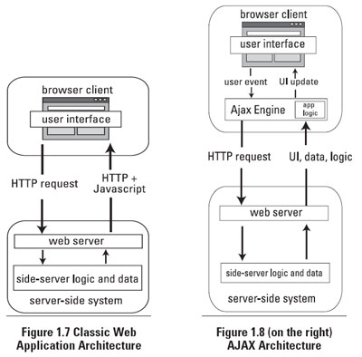

# Clase 2


### Trabajando con APIs

> Una API representa la capacidad de comunicación entre componentes de software.

**CRUD**


- **Create** (POST):
  - Respuesta 200 - OK
  - Respuesta 204 - Sin contenido
  - Respuesta 404 - No encontrado
  - Respuesta 409 - Conflicto, ya existe
- **Read** (GET):
  - Respuesta 200 - OK
  - Respuesta 404 - No encontrado
- **Update** (PUT):
  - Respuesta 200 - OK
  - Respuesta 204 - Sin contenido
  - Respuesta 404 - No encontrado
- **Delete** (DELETE):
  - Respuesta 200 - OK
  - Respuesta 404 - No encontrado


**Códigos de respuesta HTTP**:

- 1xx Informativas
- 2xx Peticiones Correctas
- 3xx Redirecciones
- 4xx Errores Cliente
- 5xx Errores Servidor


[Lista de respuestas HTTP](https://es.wikipedia.org/wiki/Anexo:C%C3%B3digos_de_estado_HTTP)

[Especificación](https://tools.ietf.org/html/rfc2616#section-10)

**Ejemplos**:
- [API RTVE](https://github.com/UlisesGascon/RTVE-API)
- [API Github](https://developer.github.com/v3/)


### AJAX

> Asynchronous JavaScript And XML, es una técnica de desarrollo web para crear aplicaciones interactivas.



**Con Jquery**

```javascript
function peticionJqueryAjax (url) {
  $.ajax({
    dataType: "json",
    url,
  }).done((data, textStatus, jqXHR) => {
    console.log('La solicitud se ha completado correctamente.');
    console.log( data );
  }).fail((jqXHR, textStatus, errorThrown) => {
    console.log(`La solicitud a fallado: ${textStatus}`);
  });
}
  
peticionAjax('https://api.github.com/users/josex2r')
```

**Vanilla JS** (`XMLHttpRequest`)

- *readyState*:
  - 0 es *uninitialized*
  - 1 es *loading*
  - 2 es *loaded*
  - 3 es *interactive*
  - 4 es *complete*

```javascript
function peticionAjax(url) {
  const xmlHttp = new XMLHttpRequest();

  xmlHttp.onreadystatechange = function() {

    if (xmlHttp.readyState === 4 && xmlHttp.status === 200) {
      console.info(JSON.parse(xmlHttp.responseText));
    } else if (xmlHttp.readyState === 4 && xmlHttp.status === 404) {
      console.error('ERROR! 404');
      console.info(JSON.parse(xmlHttp.responseText));
    }
  };
  xmlHttp.open('GET', url, true);
  xmlHttp.send();
}

peticionAjax('https://api.github.com/users/josex2r')
```

**Vanilla JS** (`fetch`)

```javascript
function peticionAjax(url) {
  fetch(url)
    .then((response) => response.json())
    .then((json) => {
      console.log(json);
    }, () => {
      console.error('ERROR!!!');
    });
}

peticionAjax('https://api.github.com/users/josex2r')
```

### JSON

- `JSON.parse()`: Analiza la cadena y retorna los valores

- `JSON.stringify()`: Analiza los valores y retorna una cadena 

### JSONP

> JSONP o JSON con padding es una técnica de comunicación utilizada en los programas JavaScript para realizar llamadas asíncronas a dominios diferentes.

El objeto JSON se devuelve envuelto en la llamada de una función. De esta forma, una función ya definida en el entorno de JavaScript podría manipular los datos JSON.

```javascript
jsonCallback({
  api_key: '224Wrf2asfSDfcea23reSDfqW',
  status: 'good',
  name: 'wikipedia',
  date: '27-09-1995'
});
```

Por convención, el nombre de la función de retorno se especifica mediante un parámetro de la consulta, normalmente, utilizando jsonp o callback como nombre del campo en la solicitud al servidor.

```html
<script type="text/javascript" src="http://servidor.ejemplo.com/datos.json?callback=parseJSON"></script>
```

Soporte en cliente (librerías):

- Jquery:

  ```javascript
  // Using YQL and JSONP
  $.ajax({
    url: 'http://query.yahooapis.com/v1/public/yql',
    // The name of the callback parameter, as specified by the YQL service
    jsonp: 'callback',
    // Tell jQuery we're expecting JSONP
    dataType: 'jsonp',
    // Tell YQL what we want and that we want JSON
    data: {
      q: 'select title,abstract,url from search.news where query="cat"',
      format: 'json'
    },
    // Work with the response
    success(response) {
      console.log(response); // server response
    }
  });
  ```
- [jsonp.js de Przemek Sobstel](https://github.com/sobstel/jsonp.js/blob/master/jsonp.js)
- [J50Npi.js de Roberto Decurnex](https://github.com/robertodecurnex/J50Npi/blob/master/J50Npi.js)


### Programación dirigida a eventos

> La programación dirigida por eventos es un paradigma de programación en el que tanto la estructura como la ejecución de los programas van determinados por los sucesos que ocurran en el sistema, definidos por el usuario o que ellos mismos provoquen.


> Para entender la programación dirigida por eventos, podemos oponerla a lo que no es: mientras en la programación secuencial (o estructurada) es el programador el que define cuál va a ser el flujo del programa, en la programación dirigida por eventos será el propio usuario —o lo que sea que esté accionando el programa— el que dirija el flujo del programa. Aunque en la programación secuencial puede haber intervención de un agente externo al programa, estas intervenciones ocurrirán cuando el programador lo haya determinado, y no en cualquier momento como puede ser en el caso de la programación dirigida por eventos. [Wikiwand](https://www.wikiwand.com/es/Programaci%C3%B3n_dirigida_por_eventos)

- **Ejemplo:**

  ```javascript
  function setRandomColor(e) {
    let color = 'rgb(' + Math.floor((Math.random() * 255)) + ',';
    color += Math.floor((Math.random() * 255)) + ',';
    color += Math.floor((Math.random() * 255)) + ')';
    document.body.style.backgroundColor = color;
    console.info("Nuevo color:", color);
  }

  document.addEventListener('click', setRandomColor);
  // document.removeEventListener('click', setRandomColor);
  ```


### Terminal UNIX

- [400 comandos que deberias conocer](http://blog.desdelinux.net/mas-de-400-comandos-para-gnulinux-que-deberias-conocer/)
- [Terminal online](http://www.tutorialspoint.com/unix_terminal_online.php)
- [Webminal](http://www.webminal.org/)
- [C9 - Terminal - Documentación](https://docs.c9.io/docs/terminal)
- **Librerías**
  - [shelljs](https://www.npmjs.com/package/shelljs)
  - [node-cmd](https://www.npmjs.com/package/node-cmd)


### Multipurpose Internet Mail Extensions (MIME)

- **Más usadas:**
  - text/html
  - text/plain
  - text/css
  - image/gif
  - image/x-png
  - image/jpeg
  - application/pdf
  - application/zip
  - text/javascript
  - *[Lista Completa](http://sites.utoronto.ca/webdocs/HTMLdocs/Book/Book-3ed/appb/mimetype.html)*


### Nodejs


- Versiones:
  - Pares -> Estables
  - Impares -> inestables


[Planes e información](https://github.com/nodejs/LTS)

- Grandes Cambios, [CHANGELOG Node.js](https://github.com/nodejs/node/blob/master/doc/changelogs/CHANGELOG_ARCHIVE.md)
- Comprobar version:
  - Node

    ```
    node -v
    ```

### Hello World

```javascript
console.log("Hello World!");
```

### Librerías Nativas (CORE)

**Los estados**
- `0` *Deprecated*
- `1` *Experimental*
- `2` *Unstable*
- `3` *Stable*
- `4` *API Frozen*
- `5` *Locked*

**Los módulos**
- [Assertion testing](https://nodejs.org/api/assert.html)
- **[Buffer](https://nodejs.org/api/buffer.html)** - *Permite el trabajo con datos binarios*
- [C/C++ Addons](https://nodejs.org/api/addons.html) - *Permite integrar librerias de C/C++*
- **[Child Processes](https://nodejs.org/api/child_process.html)** - *Permite crear y gestionar subprocesos*
- [Cluster](https://nodejs.org/api/cluster.html) - *Permite gestionar nuestro proceso principal e "hijos" entre diversos módulos*
- [Command Line Options](https://nodejs.org/api/cli.html) - *Controla el lanzamiento de Node por Consola*
- [Console](https://nodejs.org/api/console.html) - *Permite trabajar con la consola (terminal), imitando la consola del navegador*
- [Crypto](https://nodejs.org/api/crypto.html) - *Relacionado a las funcionalidades de criptografía necesarias apra algunso protocolos como SSL*
- [Debugger](https://nodejs.org/api/debugger.html) - *Utilidades de depuración*
- [DNS](https://nodejs.org/api/dns.html) - *Gestion y resolución de nombres de Dominios*
- [Domain](https://nodejs.org/api/domain.html) - *DEPRECIADO*
- [Errors](https://nodejs.org/api/errors.html) - *Gestión de errores*
- **[Events](https://nodejs.org/api/events.html)** - *Permite gestionar y crear eventos*
- **[File System](https://nodejs.org/api/fs.html)** - *Permite manipular y crear ficheros en el sistema*
- [Globals](https://nodejs.org/api/globals.html) - *Ámbito global*
- **[HTTP](https://nodejs.org/api/http.html)** - *Gestión del protocolo HTTP*
- **[HTTPS](https://nodejs.org/api/https.html)** - *Gestión del protocolo HTTPS (http y tls/ssl)*
- **[Modules](https://nodejs.org/api/modules.html)** - *Gestión y carga de módulos*
- [Net](https://nodejs.org/api/net.html) - *Nos aporta una capa de red asíncrona y permite gestionar "streams" tanto cliente como servidor.*
- [OS](https://nodejs.org/api/os.html) - *Información básica sobre el sistema operativo en el que estamos funcionando*
- **[Path](https://nodejs.org/api/path.html)** - *Gestión de rutas dentro del sistema (navegación de carpetas y archivos)*
- **[Process](https://nodejs.org/api/process.html)** - *Objeto global que gestiona el proceso del sistema que representa nuestra ejecución de Node*
- [Punycode](https://nodejs.org/api/punycode.html) - *Sintaxís de codificación a RFC 3492 y RFC 5891*
- **[Query Strings](https://nodejs.org/api/querystring.html)** - *Manipualción y gestion de cadenas URL*
- [Readline](https://nodejs.org/api/readline.html) - *Puede leer línea a línea información de entrada como la consola*
- [REPL](https://nodejs.org/api/repl.html) - *Read-Eval-Print-Loop (REPL)*
- **[Stream](https://nodejs.org/api/stream.html)** - *Interfaz abstracta usada por otros módulos para gestionar el flujo de la información*
- **[Timers](https://nodejs.org/api/timers.html)** - *Funciones globales de tiempo como setInterval, clearInterval, etc...*
- [TLS/SSL](https://nodejs.org/api/tls.html) - *Capa de encriptación basada en OpenSSL*
- [UDP/Datagram](https://nodejs.org/api/dgram.html) - *Gestión del protocolo UDP*
- **[URL](https://nodejs.org/api/url.html)** - *Facilita la resolución y parseo de URLs*
- **[Utilities](https://nodejs.org/api/util.html)** - *Utilidades varias, la mayoría depreciadas*
- [V8](https://nodejs.org/api/v8.html) - *Información sobre v8*
- [VM](https://nodejs.org/api/vm.html) - *Permite aislar código en "sandboxes"*
- [ZLIB](https://nodejs.org/api/zlib.html) - *Permite trabajar con Gzip/Gunzip, Deflate/Inflate y DeflateRaw/InflateRaw*


### HTTP

- **Hello World con HTTP:**

  ```javascript
  const http = require('http');

  const msg = 'Hola a todos, ahora usando HTTP\n';
  
  http.createServer((req, res) => {
    res.writeHead(200, { 'Content-Type': 'text/plain' });
    res.end(msg);
  }).listen(8080, 'localhost');
  ```

- **Rediccionamiento:**

  ```javascript
  const http = require('http');
  
  http.createServer((req, res) => {
    res.writeHead(301, {
      'Location': 'http://www.google.es/'
    });
    res.end();
  }).listen(8080, 'localhost');
  ```

- **Ping (petición http):**

  ```javascript
  const http = require('http');
  
  // Ping
  function ping(host) {
    http.get(host, (response) => {
        console.log(`La respuesta de ${host} es ${response.statusCode}`)
    }).on('error', (e) => {
        console.log('Tenemos un error!! -', e.message);
    });
  }
  ping('http://www.google.com');
  ```

- **LLamada a una API para obtener un JSON**

  ```javascript
  function getJSON(endpoint) {
    return new Promise((resolve, reject) => {
        http.get(endpoint, (response) => {
            let data = '';
            
            response.on('data', (chunk) => {
                data += chunk;
            }).on('end', () => {
                try {
                    data = JSON.parse(data);
                    resolve(data);
                } catch(error) {
                    reject(error);
                }
            });
        }).on('error', reject);
    });
  }
  
  getJSON('http://ghibliapi.herokuapp.com/films/').then(console.log, console.error);
  ```

- **[Objeto Request](https://nodejs.org/api/http.html#http_http_request_options_callback)**
- **[Objeto Response](https://nodejs.org/api/http.html#http_class_http_serverresponse)**
- **[Guide - Anatomy of an HTTP Transaction](https://nodejs.org/en/docs/guides/anatomy-of-an-http-transaction/)**

### URL


- **Leyendo urls:**

  ```javascript
  const url = require('url');
  const demoURL = 'http://localhost:3000/ruta?parametro=dato#detalle';
  
  console.log('El host: ' + url.parse(demoURL).hostname);
  console.log('El puerto: ' + url.parse(demoURL).port);
  console.log('La ruta: ' + url.parse(demoURL).pathname);
  console.log('La parametro: ' + url.parse(demoURL).query);
  console.log('El hash(#): ' + url.parse(demoURL).hash);
  ```
  
  ```javascript
  const { URL } = require('url');
  
  const demoURL = new URL("http://localhost:3000/ruta?parametro=dato#detalle");
  
  console.log('Host: ' + demoURLhostname);
  console.log('Puerto: ' + demoURL.port);
  console.log('Ruta: ' + demoURL.pathname);
  console.log('Parámetros: ' + demoURL.query);
  console.log('Hash: ' + demoURL.hash);
  ```

- **Trabajando con rutas:**

  ```javascript
  const http = require('http');
  const url = require('url');
  
  http.createServer(function (req, res) {
    const pathname = url.parse(req.url).pathname;
  
    if (pathname === '/') {
      res.writeHead(200, {
        'Content-Type': 'text/plain'
      });
      res.end('Index!');
    } else if (pathname === '/otro') {
      res.writeHead(200, {
        'Content-Type': 'text/plain; charset=utf-8'
      });
      res.end('sencillamente otra página');
    } else if (pathname === '/alindex') {
      res.writeHead(301, {
        'Location': '/'
      });
      res.end();    
      
    } else {
      res.writeHead(404, {
        'Content-Type': 'text/plain'
      });
      res.end('Querido... 404!');
    }
  }).listen(8080, 'localhost');
  ```

- **Ping recurrente (consola):**

  ```javascript
  const http = require('http');
  const url = "google.es";
  const tiempo = 3500;
  
  setInterval(function() {
    http.get({ host: url }, function(res) {
      if (res.statusCode === 200 ) {  
        console.log(`Sin errores en ${url}`);
      } else {
        console.log(`Respuesta Http ${res.statusCode} en ${url}`);
      }    
    }).on('error', function(e) {
      console.log(`Con errores -> La respuesta de ${url} es ${e.message}`);
    });
  }, tiempo);
  ```


### Asincronía:

> El modelo de programación de Node.js es monohilo, asíncrono y dirigido por eventos. 
1. No puede haber código bloqueante o todo el servidor quedará bloqueado y esto incluye no responder a nuevas peticiones entrantes.
2. La asincronicidad implica que no sabemos cuándo ni en que orden se va a ejecutar el código, generalmente esto no es importante pero en ocasiones sí lo es y habrá que tenerlo en cuenta.
3. En caso de error inesperado debemos capturarlo y controlar el posible estado en que haya podido quedar la ejecución del código.
> Nicolas Nombela en [nnombela](http://nnombela.com/blog/2012/03/21/asincronicidad-en-node-dot-js/)

- **Síncrono - código bloqueante:**

  ```javascript
  const http = require('http');
  let numeroPeticion = 1
    
  function writeResponse(response) {
    response.writeHead(200, {'Content-Type': 'text/plain'});
    response.write('Hola Mundo!, numero de peticion ', numeroPeticion);
    response.end();
    console.log('Se termino... ', numeroPeticion);
  }
    
  function sleepSynch(seconds, response) {
    const startTime = new Date().getTime();
    while (new Date().getTime() < startTime + Math.floor((Math.random() * 1000) + 500) * seconds) {
      // Nada pasa....
    }
    writeResponse(response);
  }
    
  http.createServer(function(request, response) {
    console.log('Empezo...', numeroPeticion);
    sleepSynch(10, response);
    numeroPeticion++;
  }).listen(8080);
  ```

- **Asíncrono - timeOut()**

  ```javascript
  const http = require('http');

  function writeResponse(response) {
    response.writeHead(200, {'Content-Type': 'text/plain'});
    response.write('Hola Mundo!');
    response.end();
    console.log('Se termino... ');
  }
  
  function sleepAsynch(seconds, response) {
    setTimeout(function() {
      writeResponse(response);
    }, 3000);
  }
  
  http.createServer((request, response) => {
    console.log('Empezo... ');
    sleepAsynch(10, response);
  }).listen(8080);
  ```


### Mantener Node funcionando

- Se cierra:

  ```javascript
  setTimeout(function (){
    process.stdout.write("Cerrando Node...")
  }, 1000)
  ```

- Se mantiene:

  ```javascript
  setInterval(function (){
    // Nada pasa... pero sigo funcionando
  }, 1000)
  ```
  
- Programando una salida:

  ```javascript
  let contador = 0
  setInterval(() => {
    contador++
    if(contador > 10){
      process.exit()
    } else {
      console.log('Sigo. Valor contador -> ', contador);
    }
  }, 1000);
  ``` 


### File System

- **Leer un archivo**

  ```javascript
  const fs = require('fs');
  
  fs.readFile('archivo.txt', 'utf8', (err, data) => {
    if (!err) {
      console.log(data);
    } else {
      throw err;
    }
  });
  ```

- **Escribir un archivo**

  ```javascript
  const fs = require('fs');

  const data = "y esto... se guardará en 'test.txt'";

  fs.writeFile('test.txt', data, (err) => {
    if (!err) {
      console.log('Datos guardados en el \'test.txt\'');
    } else {
      throw err;
    }
  });
  ```

- **Usando Promesas y Callbacks**

  ```javascript
  const fs = require('fs');
  
  // Con CallBacks!
  fs.readFile('./README.md', (error, content) => {
    console.log('Leyendo el archivo...');
    fs.writeFile('./length.txt', content.length, (error) => {
      if (error) {
        console.log('error! ', error);
      } else {
        console.log('Terminado... hemos almacenado una cadena que vale ', content.length);
      }
    });
  });

  // Con Promesas!
  function leerArchivo (file) {
    return new Promise((resolve, reject) => {
      fs.readFile(file, (error, contenido) => {
        console.log('Empezando la lectura de ', file);
        if (error) {
          console.log('Error en la lectura');
          return reject(error);
        }
        console.log('Lectura finalizada en ', file);
        resolve(contenido);
      });
    });
  }

  function escribirArchivo(file, content) {
    return new Promise((resolve, reject) => {
      fs.writeFile(file, content, (error) => {
        if(error) {
  				console.log('Error en la escritura de ', file);
  				return reject(error);
  			}
  			console.log('Escritura Termianda en ', file);
  			resolve();
  		});
  	});
  }

  //Opción1
  leerArchivo('./miArchivo.txt')
    .then((content) => {
        escribirArchivo('./longitud.txt', content);
    }, (error) => {
    	console.log('Promesas con errores: ');
    	console.log(error);
    });

  //Opción2
  Promise.all([
  	leerArchivo('./otros.txt'),
  	leerArchivo('./usuarios.txt'),
  	leerArchivo('./mas_cosas.txt')
	]).then((respuestas) => {
		console.log('Tenemos un total de '+respuestas.length+' respuesta/s.');
		console.log('El primero tiene '+respuestas[0].length+' caracteres');
		console.log('El segundo tiene '+respuestas[1].length+' caracteres');
		console.log('El tercero tiene '+respuestas[2].length+' caracteres');
	});

  //Opcion3
  Promise.race([
  	leerArchivo('./otros.txt'),
  	leerArchivo('./usuarios.txt'),
  	leerArchivo('./mas_cosas.txt')
	]).then((respuesta) => {
		console.log('El más rápido tiene solo '+respuesta.length+' caracteres.');
	});
  ```

- **Ejemplo utilizando la librería [Q](https://github.com/kriskowal/q)**

  ```javascript
  const fs = require('fs');
  const Q = require('q');
  const readFile = Q.denodeify(fs.readFile);
  
  // Con CallBacks!
  readFile('./README.md').then(content) => {
    console.log('El contenido es:', content);
  }, (error) => {
    console.log('error! ', error);
  });
  ```

- **[Más métodos para:](https://nodejs.org/api/fs.html)**
	- Síncronos
	- Escucha de cambios
	- Manipulación de carpetas
	- Comprobación de ficheros/directorios
	- etc...

### Events


- Patrón Observador
- Similar al navegador

- **Suscribiendonos a eventos**
	- Sin eventos

	```javascript
	const http = require('http');
	
	const server = http.createServer((request, response) => {
		response.writeHead(200, {'Content-Type': 'text/plain'});
		response.end('¡Hola people!');
	}).listen(8080);
	```

	- Con eventos

	```javascript
	const http = require('http');
	
	const server = http.createServer().listen(8080);
	
	server.on('request', (request, response) => {
		response.writeHead(200, {'Content-Type': 'text/plain'});
		response.end('¡Hola people!');
	});
	```

- **Ejemplo sencillo: Creando nuestros eventos**

  ```javascript
  const events = require('events');
  const EventEmitter = events.EventEmitter;
  
  const ee = new EventEmitter(); 
  ee.on('current-date', (date) => { 
     console.log(date); 
  }); 
  setInterval(() => { 
     ee.emit('current-date', Date.now()); 
  }, 500);
  ```

- **Ejemplo: Juguemos al Ping-Pong**

  ```javascript
  const { EventEmitter } = require('events');
  const pingPong = new EventEmitter();
  
  let pingNumero = 1;
  
  console.log('Bienvenido al juego de Ping/Pong!');
  console.log('Empezamos en 5 segundos....');
  
  setTimeout(() => {
    console.log('Primer Ping... que desencadenará el juego');
    pingPong.emit('ping', pingNumero);
    pingNumero++;
  }, 5000);
  
  pingPong.on('ping', (numero) => {
    console.log('Llegó el Ping('+numero+'). Emitimos Pong');
    setTimeout(() => pingPong.emit('pong'), 1000);
  });
  
  pingPong.on('pong', () => {
    console.log('Llegó el Pong. Emitimos Ping');
    setTimeout(() => {
      pingPong.emit('ping', pingNumero);
      pingNumero++;
    }, 1000);
  });
  ```

### Repasar los conceptos clave

**Loop**

- [The JavaScript Event Loop: Explained](http://blog.carbonfive.com/2013/10/27/the-javascript-event-loop-explained/)


**Arquitecura diferente**


**Single Thread**


**Multi Thread**


### Process

- **[Códigos de salida en Node.js](https://nodejs.org/dist/latest-v4.x/docs/api/process.html#process_exit_codes)**
  - 1 - *Uncaught Fatal Exception - No ha podido ser capturada*
  - 2 - **Unused (reserved by Bash for builtin misuse)**
  - 3 - *Internal JavaScript Parse Error *
  - 4 - *Internal JavaScript Evaluation Failure *
  - 5 - *Fatal Error - There was a fatal unrecoverable error in V8.*
  - 6 - *Non-function Internal Exception Handler*
  - 7 - *Internal Exception Handler Run-Time Failure*
  - 8 - **Unused**
  - 9 - *Invalid Argument*
  - 10 - *Internal JavaScript Run-Time Failure *
  - 12 - *Invalid Debug Argument*
  - 128 - *Signal Exits - El sistema operativo acaba con Node.*


- **process.argv:**

  ```javascript
  console.log(process.argv)
  /*
  1. ubicacion de node (bin)
  2. ubicación del script (location)
  3. [Otros parametros]
  */
  ```

- **Detalles del sistema**

  ```javascript
  process.argv[2] = process.argv[2] || "Node.js funcionando desde C9.io";

  console.log("===================================");
  console.log("Id: " + process.pid);
  console.log("Título: " + process.title);
  console.log("Ruta: " + process.execPath);
  console.log("Directorio Actual: " + process.cwd());
  console.log("Node Versión: " + process.version);
  console.log("Plataforma: " + process.platform);
  console.log("Arquitectura: " + process.arch);
  console.log("Tiempo activo: " + process.uptime());
  console.log("Versiones Dependencias: ");
  process.argv.forEach((val, index, array) => {
        console.log(`${index}: ${val}`);
  });
  console.log("===================================");
  ```

- Librerías para controlar los parámetros de un script:
  - [commander](https://www.npmjs.com/package/commander)
  - [meow](https://github.com/sindresorhus/meow)
  - [minimist](https://github.com/substack/minimist)
  - [Inquirer (input vía cli)](https://github.com/SBoudrias/Inquirer.js)

- **console.log("Hola"):**

  ```javascript
  const mensaje = "Hola"
  process.stdout.write(mensaje + '\n')
  ```

- **Captura de errores inesperados**

  ```javascript
  process.on('uncaughtException', (error) => {
    console.error(error.stack);
  });
  ```

- **Ejecucción de tareas antes de la finalización del proceso**

  ```javascript
  process.on('exit', function (err) {
    // Limpiar cache.. y cosas similares...
  });
  ```

- **Captura de [señales en entronos UNIX](https://www.wikiwand.com/en/Unix_signal)**

  ```javascript
  // SIGINT -> Control-C
  process.stdin.resume(); // Evitamos que se cierre Node.js
  
  process.on('SIGINT', function() {
    console.log('Llegó SIGINT. Control-C... Saliendo...');
    process.exit(0);
  });
  ```

### Creando ejecutables

- Solo para entornos UNIX

- Necesitamos *shebang*
  
  > Shebang es, en la jerga de Unix, el nombre que recibe el par de caracteres #! que se encuentran al inicio de los programas ejecutables interpretados.

  ```javascript
  #!/usr/bin/env node
  console.log('Soy un script!');
  ```

- Necesitamos hacer el script ejecutable

  ```
  chmod +x mi_escript_archivo.js
  ```

- Ejecutando el script

  ```
  ./mi_escript_archivo.js <parámetro>
  ```

- **Ejemplo: Hello world!**

  ```javascript
  #!/usr/bin/env node
  console.log('Hello World!');
  process.exit(1); // Por defecto la salida es '1'
  ```

**Arrancar Scripts al incio del sistema**
- Librerías:
  - [node-upstarter](https://github.com/carlos8f/node-upstarter) 


###  Child Process

- Ideal para tareas pesadas, inestables o muy lentas
- Nos permite usar comandos del sistema.
- Podemos lanzar aplicaciones basadas en otros lenguajes o sistemas.

- **Creando hijos y usando spawn**
-  *spawn* devuelve un *stream*

  ```javascript
  const spawn = require('child_process').spawn;
  const ping = spawn('ping', ['fictizia.com']);
  
  ping.stdout.setEncoding('utf8');
  ping.stdout.on('data', console.log);
  ```

- **Creando hijos y usando exec**
-  *exec* retorna un *buffer*

  ```javascript
  const { exec } = require('child_process');

  // cat solo funciona en UNIX
  exec('cat README.md', (err, stdout, stderr) => {
    if(!err){  
      console.log('El contenido de nuestro archivo', stdout)
    } else {
      console.log('Error: '+err)
    }
  });
  ```

- **Manejando hijos:**

  ```javascript
  const { spawn } = require('child_process');

  if(process.argv[2] === 'hijo'){
    console.log('Estoy dentro del proceso hijo');
  } else {
    console.log('Estoy dentro del proceso padre');
    const hijo = spawn(process.execPath, [__filename, 'hijo'])
    hijo.stdout.pipe(process.stdout)
  }
  ```

- **Manejando hijos (con herencia):**

  ```javascript
  const spawn = require('child_process').spawn

  if(process.argv[2] === 'hijo'){
    console.log('Estoy dentro del proceso hijo');
  } else {
    console.log('Estoy dentro del proceso padre');
    const hijo = spawn(process.execPath, [__filename, 'hijo'], {
      stdio: 'inherit'
    })
  }
  ```

### Cluster

> A single instance of Node.js runs in a single thread. To take advantage of multi-core systems, the user will sometimes want to launch a cluster of Node.js processes to handle the load.

- **Sin usar Cluster**

  ```javascript
  const http = require('http');
  const url = require('url');

  const server = http.createServer().listen(8080);

  server.on('request', (req, res) => {
      const pathname = url.parse(req.url).pathname;
      if (pathname === '/kill') {
          res.writeHead(200, {
              'Content-Type': 'text/plain'
          });
          res.end('Has matado el monohilo. PID: ' + process.pid);
          process.exit(0);
      } else {
          res.writeHead(200, {
              'Content-Type': 'text/plain'
          });
          res.end('Hola desde el monohilo. PID: ' + process.pid);
      }
  });
  ```

- **Usando Cluster.**
  - El proceso hijo que cae se vuelve a levantar.
  - El proceso padre se mantiene "separado"

  ```javascript
  const cluster = require('cluster');
  const http = require('http');
  const url = require('url');
  const cpus = require('os').cpus().length; // nproc
  
  if (cluster.isMaster) {
    console.log('Proceso maestro con PID:', process.pid);

    for (let i = 0; i < cpus; i++) {
      cluster.fork();
    }

    cluster.on('exit', (worker) => {
      console.log('hijo con PID ' + worker.process.pid + ' muerto');
      cluster.fork();
    });
  
  } else {
    console.log('Arrancado hijo con PID:', process.pid);

    const server = http.createServer().listen(process.env.PORT);

    server.on('request', (req, res) => {
      const pathname = url.parse(req.url).pathname;
      if (pathname === '/kill') {
        res.writeHead(200, {
            'Content-Type': 'text/plain'
        });
        res.end('Has matado al proceso hijo ' + process.pid);
        process.exit(0);
      } else {
        res.writeHead(200, {
            'Content-Type': 'text/plain'
        });
        res.end('Hola desde ' + process.pid);
      }
    });
  }
  ```

- [Taking Advantage of Multi-Processor Environments in Node.js](http://blog.carbonfive.com/2014/02/28/taking-advantage-of-multi-processor-environments-in-node-js/#tldr)

- **Librerias:**
  - [luster](https://github.com/nodules/luster)
  - [cluster-map](https://www.npmjs.com/package/cluster-map)
  - [PM2](https://www.npmjs.com/package/pm2)

### Buffer

- Nos ofrece la posibilidad de alamacenar datos sin procesar
- Una vez iniciados no puede modificarse el tamaño
- Tamaño máximo 1GB

```javascript
const buf1 = new Buffer(10); // buf1.length = 10
const buf2 = new Buffer([1,2,3]); // [01, 02, 03]
const buf3 = new Buffer('prueba'); // ASCII [74, 65, 73, 74]
const buf4 = new Buffer('ñam ñam', 'utf8'); // UTF8 [74, c3, a9, 73, 74]
  
console.log("===================================");
console.log("buf1: " + buf1.length);
console.log("buf2: " + buf2[0]);
console.log("buf3: " + buf3);
console.log("buf3 (hex): " + buf3.toString('hex'));
console.log("buf3 (base64): " + buf3.toString('base64'));
console.log("buf4: " + buf4);
console.log("buf4 (hex): " + buf4.toString('hex'));
console.log("buf4 (base64): " + buf4.toString('base64'));
console.log("===================================");
```


### Stream

- Gestionamos el *flujo de datos*
- Muy usados por librerías y modulos (ej. `gulp`)
- Capa de abstracción para operaciones con datos
- Lógica de tuberias (cadena de procesos)
- Gestiona el *buffer* por si mismo
- Tipos:
  - Readable *Lectura*
    - Eventos (data, error, end)
  - Writable *Escritura*
    - Eventos (drain, error, finish)
  - Duplex *Ambos*
  - Transform *Transformación de datos*
- **Función .pipe()**
  - Simple: 
  `origen.pipe(destino);`
  - Concatenando:
  `origen.pipe(destino).pipe(otroDestino);`

- **Ejemplo: Stream multimedia**

  ```javascript
  const http = require('http');
  const fs = require('fs');
  
  http.createServer((req, res) => {
    const song = 'song.mp3';
    const stat = fs.statSync(song);
  
    res.writeHead(200, {
      'Content-Type': 'audio/mpeg',
      'Content-Length': stat.size
    });
  
    const readableStream = fs.createReadStream(song);
    readableStream.pipe(res);
  }).listen(8080);
  ```

- **Stream y ficheros**

  ```javascript
  const fs = require('fs');
  
  const lectura = fs.createReadStream('README.md');
  const escritura = fs.createWriteStream('COPY.md');
  
  lectura.pipe(escritura);
  ```

- **Comprueba como el tiempo de respuesta es menor utilizando streams**

  ```javascript
  const http = require('http');
  const fs = require('fs');
  const url = require('url');

  function createBigFile() {
    const file = fs.createWriteStream('bigfile.txt');
  
    for(let i=0; i<= 1e6; i++) {
      file.write('Lorem ipsum dolor sit amet, consectetur adipisicing elit, sed do eiusmod tempor incididunt ut labore et dolore magna aliqua. Ut enim ad minim veniam, quis nostrud exercitation ullamco laboris nisi ut aliquip ex ea commodo consequat. Duis aute irure dolor in reprehenderit in voluptate velit esse cillum dolore eu fugiat nulla pariatur. Excepteur sint occaecat cupidatat non proident, sunt in culpa qui officia deserunt mollit anim id est laborum.\n');
    }
  
    file.end();
  }

  createBigFile();

  http.createServer((request, response) => {
    const { pathname } = url.parse(request.url);
  
    if (pathname === '/stream') {
      const bigfile = fs.createReadStream('bigfile.txt');
      
      bigfile.pipe(response);
    } else {
      fs.readFile('bigfile.txt', 'utf-8', (err, data) => {
        response.end(data);
      });
    }
  }).listen(8080);
  ```


### Variables del Entorno

- Conocer todas las variables disponibles en el entorno
  - Windows: 

  ```
  SET
  ```

  - UNIX: 

  ```
  env
  ```

- Guardar nuevas variables en el entorno
  - Windows: 

  ```
  SET ALGO='mi secreto'
  ```

  - UNIX: 

  ```
  export ALGO='mi secreto'
  ```
  
- Recuperar las variables con Node.js

  ```javascript
  const datoRecuperado = process.env.ALGO;
  console.log(process.env.ALGO);
  ```

- Creando variables del entorno limitadas a Node.js y temporales (SOLO UNIX)
  - Arrancando...   

  ```
  NODE_ENV=production node app.js
  ```

  - Usando datos...

  ```javascript
  if(process.env.NODE_ENV === "production"){
    console.log("Entramos en modo producción");
  } else if (process.env.NODE_ENV === "development"){
    console.log("Entramos en modo desarrollo");
  } else {
    console.log("Entramos en modo desconocido. ¡Revisa las variables del entorno!");
  }
  ```  
  
- **Alternativas**
  - [dotenv - librería para Nodejs](https://github.com/motdotla/dotenv)

### Modularización

- Especificación de [CommonJS](https://www.wikiwand.com/en/CommonJS)
- Exports es un objeto que vamos "rellenando"
- La asignacion al exports es inmediata. No se pueden usar callbacks o similares
- No es necesario usar *module.exports* ya es que es global.
  - `const exports = module.exports = {};`
- Es importante controlar la reasignación de *module.exports*

### Modularización: Usando exports

- **Exportar los datos:**

  ```javascript
  // archivo -> config.js
  
  const datoPrivado = "Lo que pasa en Node... se queda en Node";
  const datoCompartido = "Hola! desde Config.js"
  
  function privada (){
    return datoPrivado;
  }
  
  exports.metodo = function () {
    console.log(datoCompartido);
    console.log(privada());
  }
  exports.mensaje = datoCompartido;
  ```

- **Importar los datos:**

  ```javascript
  const config = require('./config');
  
  config.metodo();
  console.log(config.mensaje);
  ```

### Modularización: Usando module.exports

- **Exportar los datos:**

  ```javascript
  // archivo -> config.js
  const config = {
    token: "<--- MiSecreto--->",
  };
  
  module.exports = config;
  ```

- **Importar los datos:**

  ```javascript
  const config = require('./config');
  
  console.log(config.token);
  ```

### NPM


**[Librerías interesantes de node](https://github.com/sindresorhus/awesome-nodejs#command-line-utilities)**

- ** Comprobar versión**

  ```
  npm -v
  ```

- **Instalar paquetes:**
  - global:

    ```
    npm install -g <paquete>
    ```  

  - local:

    ```
    npm install <paquete>
    ```    

- **Buscar paquetes**

  ```
  npm search <paquete>
  ```

- **Información de los paquetes**

  ```
  npm view <paquete>
  ```

- **Lista de paquetes instalados**

  ```
  npm ls
  ```

- **Lista de paquetes instalados globalmente**

  ```
  npm ls -g
  ```

- **Instalando versiones especificas:**

  - la más reciente:

    ```  
    npm install <paquete>@latest
    ```  
  
  - versión especifica:

    ```  
    npm install <paquete>@1.x (1.xx.xx)
    ```
  
  - Otra versión especifica

    ```
    npm install <paquete>@2.10.x (2.10.x)
    ```

- **Paquetes desactualziados:**

  ```
  npm outdated
  ```
  
- **Actualizando paquetes:**

  ```
  npm update <paquete>
  ```

- **Desinstalando paquete:**

  ```
  npm uninstall <paquete>
  ```

- **Información sobre Bugs**

  ```
  npm bugs <paquete>
  ```

- **[Más comandos - CLI](https://docs.npmjs.com/cli/install)**

### npx


A partir de la versión [`v5.2.0`](https://github.com/npm/npm/releases/tag/v5.2.0) de `npm` se incluye un nuevo binario llamado `npx`.

Al igual que `npm` permite manejar las dependencias de un proyecto a través del repositorio de paquetes, con `npx` también vamos a poder manejar ejecutables que no tengamos instalados en nuestra máquina.
Si ejecutamos un comando a través de `npx` (ej. `npx cowsay "Hola"`) se intentará ejecutar dicho paquete desde nuestro directorio actual, en el caso de que no se encuentre descargado se descargará automáticamente y se ejecutará.

Un uso común que se le puede dar es el de ejecutar paquetes que normalmente no utilizamos a menudo (por ejemplo `yeoman` o `create-react-app`), como pueden ser generadores de código o paquetes que no queramos descargar para ocupar sitio en el disco.

También se puede utilizar para invocar paquetes en otras versiones de node:

```bash
# Con "-p" añadimos un paquete a "$PATH"
npx -p node@8 npx cowsay "Hola"
```

```bash
# Descargamos cowsay y lolcatjs, a continuación hacemos un "echo"
# y la salida se la pasamos a "cowsay" y "lolcat"
npx -p cowsay -p lolcatjs -c 'echo "$npm_package_name@$npm_package_version" | cowsay | lolcatjs'
```

### Dependency Hell:

**Abyssus abyssum invocat. El abismo llama al abismo.**

- [nipster](http://nipstr.com/)
- [Nodei.co](https://nodei.co/)
- [Dependency Hell](http://www.wikiwand.com/en/Dependency_hell)
- [David Dm](https://david-dm.org/)
   - [Ejemplo Twitter-sentiments](https://david-dm.org/UlisesGascon/twitter-sentiments#info=dependencies&view=list)
   - [Ejemplo Grunt](https://david-dm.org/gruntjs/grunt#info=dependencies&view=table)
   - [Ejemplo Express](https://david-dm.org/strongloop/express)
   - [Ejemplo Bower](https://david-dm.org/bower/bower#info=dependencies&view=table)
- [ShieldsIO](http://shields.io/)
   - [Your Badge Service](http://badges.github.io/gh-badges/) 

### Seguridad:
- [Seguridad](https://nodesecurity.io/resources)
- [Seguridad Avisos](https://nodesecurity.io/advisories)
- [Recursos](https://nodesecurity.io/resources)
- [snyk](https://snyk.io/test)

### package.json

- Datos proyecto
- Tareas
- Dependencias (dependencies y devDependencies)
- **[Documentación](https://docs.npmjs.com/files/package.json)**

- **Creación:**

  ```
  npm init
  ```
  
- **Guardar nuevas dependencias:**

  ```
  npm install <paquete> --save
  ```

- **Guardar nuevas dependencias (solo para entorno desarrollo):**

  ```
  npm install <paquete> --save -dev
  ```

- **Guardando versiones especificas:**
  - (1.xx.xx):

    ```
    npm install --save <paquete>@1.x
    ```
  
  - (2.10.x)

    ```
    npm install --save <paquete>@2.10.x
    ```
  
  - Latest

    ```
    npm install --save <paquete>@lastest
    ```
  
- **Quitando dependencias:**

  ```
  npm uninstall <paquete> --save
  ```
  
- **Instalamos las dependencias en el proyecto:**
  - todo:

    ```
    npm install (todo)
    ```
  
  - Solo production:

    ```
    npm install --production (solo producción)
    ```
  
  - Solo development:

    ```
    npm install --dev
    ```

- **[Semantic Versioning](http://semver.org/lang/es/)**
  - Estructura -> X.Y.Z-Extra 
  - Cambio Mayor - *No retrocompatible*
  - Cambio Menor - *Retrocompatible - Nuevas funcionaldiades o cambios*
  - Parche - *Retrocompatible - Solución de errores*
  - Extras - Indicativos o versiones especiales (Beta, Alfa, x86, etc...)

### npm scripts (comandos de CLI)

- **Añadiendo comandos:**

  ```javascript
  // ...
  "scripts": {
      "test": "npm -v",
      "start": "node -v",
      "hola": "echo 'Hola mundo!'"
  }
  // ...
  ```

- **Mostrando todos los comandos:**
  
  ```
  npm run
  ```

- **Ejecutando comandos:**
  - test

    ```
    npm test
    ```

  - start

    ```
    npm start
    ```

  - hola

    ```
    npm run hola
    ```  


### NVM  (manejando varias versiones de Node)

- **Comrpobando la version de NVM:**

  ```
  nvm --version
  ```

- **Instalando una version:**

  ```
  nvm install 0.12
  ```

- **Desinstalando una version:**

  ```
  nvm uninstall 0.12
  ```

- **Usar una version (globalmente):**

  ```
  nvm use 0.12
  ```
  
- **Usando versiones (por proyecto):**

  ```
  echo 0.12 > .nvmrc
  ```
  
  ```
  nvm use
  ```


### Actualizando Node (método alternativo)
- Sin soporte a Windows
- Instalando el [paquete n](https://www.npmjs.com/package/n)

  ```
  npm install -g n
  ```

- **Opciones**

  ```
  n                              Output versions installed
  n latest                       Install or activate the latest node release
  n -a x86 latest                As above but force 32 bit architecture
  n stable                       Install or activate the latest stable node release
  n lts                          Install or activate the latest LTS node release
  n <version>                    Install node <version>
  n use <version> [args ...]     Execute node <version> with [args ...]
  n bin <version>                Output bin path for <version>
  n rm <version ...>             Remove the given version(s)
  n --latest                     Output the latest node version available
  n --stable                     Output the latest stable node version available
  n --lts                        Output the latest LTS node version available
  n ls                           Output the versions of node available
  ```


### Ejercicios

**1 -** Crea las rutas básicas para tener una página web clásica:
  - Debe responder con contenido HTML
  - `/`: Mostrará un título (`h1`) con el texto `Bienvenido`
  - `/contact`: Aparecerá un listado (`ul`) con algunos datos personales (nombre, apellidos, email, ...)
  - `/about`: Se mostrará un pequeño texto introductorio
  - `/bug`: Modificará todos los mensajes anteriores por la [siguiente imagen](https://www.iconexperience.com/_img/v_collection_png/256x256/shadow/bug_yellow_error.png)
  - En el caso de que la ruta no exista se redigirá al index (`/`)

**Solución:**

```javascript
const http = require('http');
const process = require('process');
const url = require('url');

let isBugged = false;

http.createServer((req, res) => {
  const pathname = url.parse(req.url).pathname;
  const bug = '';
  const welcome = '<h1>Bienvenido!!</h1>';
  const about = 'Somos una empresa que usa <b>la ñ y otros caracteres especiales!</b>....';
  const contact = `
    <ul>
      <li><b>Nombre:</b> Jose Luis</li>
      <li><b>Apellidos:</b> Represa </li>
    </ul>
  `;
  
  res.writeHead(200, {
    'Content-Type': 'text/html; charset=utf-8'
  });
  
  if(pathname === '/') {
    res.end(isBugged ? bug : welcome);
  } else if(pathname === '/about') {
    res.end(isBugged ? bug : about);
  } else if(pathname === '/contact') {
    res.end(isBugged ? bug : contact);
  } else if (pathname === '/bug') {
    isBugged = true;
    res.end(bug);
  } else {
    res.writeHead(301, {
      'Location': '/'
    });
  }
}).listen(8080);
```

**2 -** Crear un servidor web que al acceder te muestre el contenido del fichero que aparece en la url:
  - Dada la siguiente url: `http://localhost/README.md`
  - Hay que extraer el nombre del fichero con la librería `URL` (`README.md`)
  - Leer el fichero con el `FileSystem` (`fs`):
    - Si el fichero no existe, devolver un error 404
    - Si el fichero existe, devolver el contenido del mismo

**Solución:**

```javascript
const http = require('http');
const fs = require('fs');
const url = require('url');

http.createServer((request, response) => {
  const pathname = url.parse(request.url).pathname;
  const filename = pathname.substr(1);

  console.log(`Trying to find '${filename}'...`);
  fs.readFile(filename, (err, data) => {
    if (err) {
      response.writeHead(404, {'Content-Type': 'text/html'});
      response.write(`ERROR: Cannot find '${filename}'.`);
      console.log(`ERROR: Cannot find '${filename}'.`);
    } else {
      console.log(`Found '${filename}.`);
      response.writeHead(200, {'Content-Type': 'text/html'});
      response.write(data.toString());
    }
    response.end();
  });
}).listen(8080, 'localhost');
```

**3 -** Crear un servidor web con las siguientes características:
  - Al recibir una petición **GET** mostrará el texto `Hola Mundo!`
  - Si en la petición anterior llega el parámetro `search` buscará una película con ese valor utilizando [omdbAPI](http://www.omdbapi.com)
    - Puedes utilizar la api key `e9b5e65a`
    - Ejemplo: `localhost?search=Avengers`
  - Si hay resultados se mostrará el listado de películas
  - Si no hay resultados se devolverá un 404

**Solución:**

```javascript
const http = require('http');
const url = require('url');

http.createServer((req, res) => {
  const parsedUrl = url.parse(req.url, true);
  const { search } = parsedUrl.query;

  http.get(`http://www.omdbapi.com/?s=${search}&apikey=e9b5e65a`, (response) => {
    const { statusCode } = response;

    let rawData = '';
    response.setEncoding('utf8');
    response.on('data', (chunk) => rawData += chunk);
    response.on('end', () => {
      try {
        const parsedData = JSON.parse(rawData);
        
        if (!parsedData.Search.length) {
          throw new Error('No data :(');
        }
        
        res.writeHead(200);
        res.end(parsedData.Search.map((film) => film.Title).join('\n'));
      } catch(e) {
        res.writeHead(404);
        res.end('No data found :(');
      }
    });
  });
}).listen(8080);
```

**4 -** Realiza un script ejecutable que nos muestre la información de los terremotos acontecidos en la última hora.
- [Fuente de datos](http://earthquake.usgs.gov/earthquakes/feed/v1.0/geojson.php)
- Requisitos:
  - Debemos utilizar párametros cuando se ejecute para definir la magnitud de los terremotos que queremos
  - Si no se detecta el parámetro... la aplicación debe cerrarse.
  - Si el parametro es incorrecto también.
  - Ajustaremos la petición http en función del parámetro. 
- Apariencia(Orientativa):

  ```
  *****************************
  USGS All Earthquakes, Past Hour
     ---------------------     
  total: 8
  status: 200
     ---------------------     
  5/10/2016, 3:46:30 PM
  ==============================
  M 1.3 - 6km WNW of Anza, California
  5/10/2016, 3:43:01 PM
  Magnitud: 1.32
  Estatus: automatic
  Tipo: earthquake
  Lugar: 6km WNW of Anza, California
  Coordenadas: -116.7246704 , 33.5830002
  Info: http://earthquake.usgs.gov/earthquakes/eventpage/ci37563240
  Detalles: http://earthquake.usgs.gov/earthquakes/feed/v1.0/detail/ci37563240.geojson
  ==============================
  ... (por cada terremoto de los iguales a los iguales)
  ```

**Solución:**

```javascript
#!/usr/bin/env node
const https = require('https');
  
if (!process.argv[2]) {
  console.error('Necesito un parámetro para afinar mis resultados');
  process.exit(1);
} else if (!['all', '1.0', '2.5', '4.5', 'significant'].includes(process.argv[2])) {
  console.error('Parámetro incorrecto!. Solo admito:\n  - all\n - 1.0\n - 2.5\n - 4.5\n - significant\n');
  process.exit(1);
}
  
const options = {
    host: 'earthquake.usgs.gov',
    path: `/earthquakes/feed/v1.0/summary/${process.argv[2]}_hour.geojson`
};

https.get(options, (res) => {
    let data = '';

    res.on('data', (chunk) => data += chunk);
    res.on('end', () => {
      console.log(data)
      const json = JSON.parse(data);

      console.log('*****************************');
      console.log(json.metadata.title);
      console.log('   ---------------------     ');
      console.log('total:', json.metadata.count);
      console.log('status:', json.metadata.status);
      console.log('   ---------------------     ');
      console.log(new Date(json.metadata.generated).toLocaleString('es-ES'));
      console.log('==============================');
      json.features.forEach((earthquake) => {
        console.log(earthquake .properties.title);
        console.log(new Date(earthquake .properties.time).toLocaleString('es-ES'));
        console.log('Magnitud:', earthquake .properties.mag);
        console.log('Estatus:', earthquake .properties.status);
        console.log('Tipo:', earthquake .properties.type);
        console.log('Lugar:', earthquake .properties.place);
        console.log('Coordenadas:', earthquake .geometry.coordinates[0] + ' ,', earthquake .geometry.coordinates[1]);
        console.log('Info:', earthquake .properties.url);
        console.log('Detalles:', earthquake .properties.detail);
        console.log('==============================');
      });
      process.exit(0);
  });
}).on('error', function(e) {
    console.log('Error fetching data:', e.message);
    process.exit(1);
});
```

**5 -** Crearemos varios scripts para automatizar tareas utilizando `npm`:
- `npm run versions`: Tiene que mostrar las versiones de `nodejs` y `npm`
- `npm run status`: Verificador del status de Git
- `npm run curso`: Clona nuestro curso de Github
- `npm run emoji`: Muestra un emoji al azar utilizando [emoji-random](https://www.npmjs.com/package/emoji-random)
- `npm run emoji`: Muestra **la url** de un **gif** por consola [make-me-lol](https://www.npmjs.com/package/make-me-lol)

```json
{
  "name": "npm-scripts-tasks",
  "version": "1.0.0",
  "description": "",
  "main": "app.js",
  "scripts": {
    "emoji": "emoji-random",
    "versions": "node -v && npm -v",
    "bootstrap": "git clone https://github.com/twbs/bootstrap.git",
    "curso": "git clone https://github.com/Fictizia/Curso-Node.js-para-desarrolladores-Front-end_ed5.git",
    "status": "git status",
    "lol": "make-me-lol --output --gif"
  },
  "devDependencies": {
    "emoji-random": "^0.1.2"
  },
  "author": "Ulises Gascon",
  "license": "ISC"
}
```

**6 -** Crea un script que te dibuje el árbol de directorios desde donde lo has ejecutado:

```javascript
const fs = require('fs');
const path = require('path');

const PADDING = '  ';

function renderDir(dir, level) {
    console.log(PADDING.repeat(level) + path.basename(dir));
}

function drawTree(dir, level = 0) {
    const stats = fs.lstatSync(dir);
    
    if (stats.isDirectory()) {
        renderDir(dir, level);
        fs.readdirSync(dir)
            .map((filename) => path.join(dir, filename))
            .forEach((filepath) => drawTree(filepath, level + 1))
    } else if (stats.isFile()){
        renderDir(dir, level);
    }
}

drawTree(process.cwd())
```
