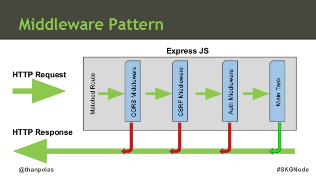
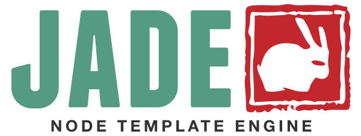

### Express


**Influencias / usos**
- Otros frameworks similares:
  - Zend (PHP)
  - Django (Python)
  - Sinatra (Ruby)

- Uso:
  - API JSON
  - Single Page Applications
  - App tiempo real

**Pros**
- Rutas
- Parámetros
- Formularios y subida de ficheros
- Cookies
- Sesiones
- Templates
- Middlewares

**Contras**
- Base de datos / ORM
- Autenticación de usuarios
- Seguridad
- Migraciones
- Deployment
- Organización del código

**Migraciones**
- [De Express 3.x a Express 4.x](http://expressjs.com/es/guide/migrating-4.html)
  - [Documentación de la 3.x (desuso)](http://expressjs.com/es/3x/api.html)
  - [Cambios](http://expressjs.com/es/guide/migrating-4.html)
  - [Nuevas funcionaldiades](https://github.com/expressjs/express/wiki/New-features-in-4.x?_ga=1.226364894.554285759.1461232316)
- [De Express 4.x a Express 5.x (hoy es Alpha)](http://expressjs.com/es/guide/migrating-5.html)
  - [Cambios Previstos](https://github.com/expressjs/express/pull/2237?_ga=1.29731835.554285759.1461232316)


**Instalación**

- Instalación local:

  ```
  npm install express
  ```

- Instalación global:

  ```
  npm install -g express
  ```

- Instalación versiones anteriores:

  ```
  npm install -g express@3.x
  ```

**Hello World!**

  ```javascript
  const express= require('express');
  const app = express();
  
  app.get('/', (req, res) => res.send('Hello World!'));
  
  app.listen(8080, () => console.log('Example app listening on port 8080'));
```

**Generador de Express**

- Instalación global del generador

  ```
  npm install express-generator -g
  ```

- Opciones de instalación

  ```
  express -h
  ```

- Generar un proyecto (genera un directorio)

  ```
  express <nombre_proyecto>
  ```

- Entramos en la carpeta e instalamos las dependencias

  ```
  cd <nombre_proyecto> && npm install
  ```

- Estructura de un Proyecto (MVC)

  ```
  ├── app.js (Nuestra aplicación - módulo)
  ├── bin (Gestión de la aplicación)
  │   └── www
  ├── package.json (Información y dependencias)
  ├── public (Nuestros estáticos)
  │   ├── images
  │   ├── javascripts
  │   └── stylesheets
  │       └── style.css
  ├── routes (Nuestros controladores)
  │   ├── index.js
  │   └── users.js
  └── views (Nuestras vistas/plantillas)
      ├── error.jade
      ├── index.jade
      └── layout.jade
  ```

- Ejecutando la aplicación:
  - Windows

    ```
      set DEBUG=<nombre_proyecto>:* & npm start
    ```

  - MacOS/Linux

    ```
      DEBUG=<nombre_proyecto>:* npm start
    ```

- Opcional: [Volviendo el arranque al estilo Express 3.x](http://expressjs.com/es/guide/migrating-4.html#app-gen)

**Partes Claves**
- [express()](http://expressjs.com/es/4x/api.html#express)
- [Application](http://expressjs.com/es/4x/api.html#application)
- [Request](http://expressjs.com/es/4x/api.html#request)
- [Response](http://expressjs.com/es/4x/api.html#response)
- [Router](http://expressjs.com/es/4x/api.html#router)


**Mecánica: app.set()**
- Nos permite establecer la configuración de Express
- Podemos almacenar datos personalizados de manera global
- Ejemplos
  - Guardando la versión

  ```javascript
  app.set('version', '1.5.0');
  app.get('version'); // 1.5.0
  ```

  - Maneras de Habilitar contenido

  ```javascript
  app.enable('dia_soleado'); // igual a -> app.set('dia_soleado', true);
  app.enabled('dia_soleado'); // igual a -> app.get('dia_soleado') === true;
  app.disabled('dia_soleado'); // igual a -> app.get('dia_soleado') === false;
  ```  

  - Definiendo el puerto

  ```javascript
    app.set('port', process.env.PORT || 3000);
  ```

  - Configuraciones según el entorno
    - Para todos los entornos 

      ```
      NODE_ENV=production node app.js
      ```
  
      ```javascript
      app.set('estado_aplicacion', '*');
      ```

    - Solo desarrollo

      ```
      NODE_ENV=development node app.js
      ```

      ```javascript
      if (NODE_ENV === 'develop')
        app.set('estado_aplicacion', 'development');
      }
      ```

    - Solo producción

      ```
      NODE_ENV=production node app.js
      ```
  
      ```javascript
      if (NODE_ENV === 'production')
        app.set('estado_aplicacion', '*');
      }
      ```

    - Solo personalizado

      ```
      NODE_ENV=personalizado1 node app.js
      ```

      ```javascript
      if (NODE_ENV === 'personalizado1')
        app.set('estado_aplicacion', '*');
      }
      ```

  - Motores de Plantillas
    - Variables locales (solo disponibles para las plantillas)

      ```javascript
      // Guardando
      app.locals.title = 'My App';
      app.locals.email = 'me@myapp.com';
      
      // Usando
      app.locals.title // My App
      app.locals.email // me@myapp.com
      ```

    - Definiendo el sistema de plantillas que usaremos

      ```javascript
      // npm install pug --save
      const express = require('express');
      const app = express();
      
      app.set('view engine', 'pug');
      
      app.get('/', (req, res) => {
          res.render('index', { title: 'Hey', message: 'Hello there!'});
      });
      
      app.listen(8080);
      ```

- [Comparativa de Motores de plantillas](https://developer.ibm.com/node/2014/11/11/compare-javascript-templates-jade-mustache-dust/)


**Mecánica: app.all(), app.get(), app.post(), app.put(), app.delete(), app.route()**

```javascript
app.METODO(Ruta, Manejador)
```

- Estructura
  - app *Instanciado de express*
  - METODO *[Metodo HTTP](https://www.wikiwand.com/es/Hypertext_Transfer_Protocol) de la Ruta*
    - Soportados: get, post, put, head, delete, options, trace, copy, lock, mkcol, move, purge, propfind, proppatch, unlock, report, mkactivity, checkout, merge, m-search, notify, subscribe, unsubscribe, patch, search y connect.
    - Para todas las rutas usamos *app.all()*
  - Ruta *Ruta (url) donde se aplica*
    - Podemos usar
      - Series
      - Patrones de Series (Subtipo de Regex)
        - Reducido a los subconjuntos ?, +, *, y ()
      - [Expresiones regulares](https://regex101.com/)
  - Manejador *La función que será llamada cuando se alcance la ruta con el método/s correctos/s*
    - Se puede usar funciones individuales
    - Se pueden hacer matrices de funciones
    - Se pueden mezclar matrices y funciones individuales
    - Argumentos:
      - Obj Request de Node.js
      - Obj Response de Node.js
      - next() *Función que dispara el siguiente middleware*

- Métodos HTTP: delimitando a un único método

  ```javascript
  app.get('/', (req, res, next) => {
    res.send('Solo get como método me vale...');
  });
  ```

- Métodos HTTP: Otra forma de delimitar a un método 

  ```javascript
  app['m-search']('/', (req, res, next) => {
    res.send('Solo m-search como método me vale...');
  });
  ```

- Métodos HTTP: permitiendo todos los métodos

  ```javascript
  app.all('/', (req, res, next) => {
    res.send('Cualquier método me vale...');
  });
  ```

- Rutas: Raiz `http://localhost:8080/`

  ```javascript
  app.get('/', (req, res, next) => {
    res.send('Esto es la Raiz');
  });
  ```
- Rutas: Básicas http://localhost:8080/hola

  ```javascript
  app.get('/hola', (req, res, next) => {
    res.send('Esto es /hola');
  });
  ```

- Rutas: Capturando Parámetros `http://localhost:8080/hola/Eduardo`, `http://localhost:8080/hola/Oscar`, ...

  ```javascript
  app.get('/hello/:nombre', (req, res) => {
      res.send('Hola ' + req.nombre + '!');
  });
  ```
- Rutas: Capturando varios parámetros `http://localhost:8080/desde/Madrid/a/Malga`, `http://localhost:8080/desde/Madrid/a/NYC`

  ```javascript
    app.get('/desde/:origen/a/:destino', (req, res, next) => {
      res.send('Quieres ir de ' + req.params.origen + ' a ' + req.params.destino);
    });
  ```
- Rutas: Capturando varios parámetros y alguno determiando `http://localhost:8080/mensaje/1/editar`, `http://localhost:8080/mensaje/500/borrar`, ...

  ```javascript
    app.get('/mensaje/:id/:accion(editar|borrar)', (req,res,next) => {
      res.send('Quieres ' + req.params.accion + ' el mensaje numero ' + req.params.id);
    });
  ```

- Rutas: Parámetros opcionales `http://localhost:8080/user/1/editar`, `http://localhost:8080/user/500/borrar`, ...

  ```javascript
  app.get('/user/:id/:comando?', (req, res, next) => {
    if(req.params.comando){
      res.send("Tenemos algo! Quieres " + req.params.comando);
    } else {
      res.send("Nada de nada...");
    }
  });
  ```
  
- Rutas: Más parámetros opcionales http://localhost:8080/user/1.pdf, http://localhost:8080/user/500.zip, etc...

  ```javascript
  app.get('/user/:id.:formato?', (req, res, next) => {
    if(req.params.formato){
      res.send("["+req.params.formato+"] Extensión requerida... ");
    } else {
      res.send("Sin Extensión requerida");
    }
  });
  ```

- Rutas: Tipo fichero `http://localhost:8080/hola.text`

  ```javascript
  app.get('/hola.text', (req, res) => {
    res.send('Hola');
  });
  ```

- Rutas: Patrones de serie (?) *http://localhost:8080/acd o http://localhost:8080/abcd*

  ```javascript
  app.get('/ab?cd', (req, res) => {
    res.send('ab?cd');
  });
  ```

- Rutas: Patrones de serie (+) *http://localhost:8080/abcd, http://localhost:8080/abbbbbcd, etc...*

  ```javascript
  app.get('/ab+cd', (req, res) => {
    res.send('ab+cd');
  });
  ```

- Rutas: Patrones de serie (*) *http://localhost:8080/abcd, http://localhost:8080/abAALGOOOcd, etc...*

  ```javascript
  app.get('/ab*cd', (req, res) => {
    res.send('ab*cd');
  });
  ```

- Rutas: Patrones de serie (()) *http://localhost:8080/abe o http://localhost:8080/abcd*
  
  ```javascript
  app.get('/a(bc)d', (req, res) => {
    res.send('a(bc)d');
  });
  ```

- Rutas: Expresiones regulares *http://localhost:8080/mcfly, http://localhost:8080/dragonfly, etc...*

  ```javascript
  app.get(/.*fly$/, (req, res) => {
    res.send('/.*fly$/');
  });
  ```

- Rutas: Molularidad con app.route()

  ```javascript
  app.route('/pelicula')
    .get((req, res) => {
      res.send('todas las peliculas...');
    })
    .post((req, res) => {
      res.send('Añadir una pelicula...');
    })
  ```

- Manejadores: Función individual

  ```javascript
  app.get('/example/a', (req, res) => {
    res.send('Hola desde A!');
  });
  ```

- Manejadores: Dos funciones individuales

  ```javascript
  app.get('/example/b', (req, res) => {
    console.log('La respuesta se enviará a la siguiente función...');
    next();
  }, (req, res) => {
    res.send('Hola desde B!');
  });
  ```

- Manejadores: Matrices

  ```javascript
  const cb0 = (req, res, next) => {
    console.log('CB0');
    next();
  };
  
  const cb1 = (req, res, next) => {
    console.log('CB1');
    next();
  };
  
  const cb2 = (req, res) => {
    res.send('Hola desde C!');
  };
  
  app.get('/example/c', [cb0, cb1, cb2]);
  ```

- Manejadores: Matrices y funciones individuales

  ```javascript
  const cb0 = (req, res, next) => {
    console.log('CB0');
    next();
  };
  
  const cb1 = (req, res, next) => {
    console.log('CB1');
    next();
  };
  
  app.get('/example/d', [cb0, cb1], (req, res, next) => {
    console.log('La respuesta se enviará a la siguiente función...');
    next();
  }, (req, res) => {
    res.send('Hola desde D!');
  });
  ```

- Manejadores: Objeto petición
  - `req.ip` *Almacena la IP desde donde se realizó la peticioón*
  - `req.is` *Que tipo de datos nos llegan desde la petición. Booleano*

    ```javascript
    req.is('json');
    req.is('application/*');
    req.is('application/json');
    ```
  - `req.params` *Contenido de la ruta (http://localhost:8080/usuarios/:id)*
  - `req.query` *Contenido de la consulta de la URL (http://localhost:8080/peliculas?categoria=Ficcion&director=George+Lucas)*
    - simples (http://localhost:8080/peliculas?categoria=Ficcion&director=George+Lucas):
    ```javascript
    app.get('/peliculas', function(req,res,next){
      console.log(req.query.director) // George Lucas
      console.log(req.query.categoria) // Ficcion
    });
    ```
    - Agrupados (http://localhost:8080/peliculas?categoria[tipo]=Corto&director=Yo+Mismo):
    ```javascript
    app.get('/peliculas', function(req,res,next){
      console.log(req.query.director) // Yo Mismo
      console.log(req.query.categoria.tipo) // Corto
    });
    ```
  - `req.body` *Contenido dentro de la propia petición*

- Manejadores: Métodos de respuesta
  - [res.download()](http://expressjs.com/es/4x/api.html#res.download) *Solicita un archivo para descargarlo.*
  - [res.end()](http://expressjs.com/es/4x/api.html#res.end) *Finaliza el proceso de respuesta.*
  - [res.json()](http://expressjs.com/es/4x/api.html#res.json) *Envía una respuesta JSON.*
  - [res.jsonp()](http://expressjs.com/es/4x/api.html#res.jsonp) *Envía una respuesta JSON con soporte JSONP.*
    - Valores por defecto ajustables en app.set()
      - *?callback=* valor por defecto en la petición
      - `res.jsonp({date: newDate()});`
  - [res.redirect()](http://expressjs.com/es/4x/api.html#res.redirect) *Redirecciona una solicitud.*
  - [res.render()](http://expressjs.com/es/4x/api.html#res.render) *Renderiza una plantilla a la que le pasa además datos (opcional)*
  - [res.send()](http://expressjs.com/es/4x/api.html#res.send) *Envía una respuesta de varios tipos.*
    - Muy flexible
      - Código y contenido `res.send(404,'Oops...');`
      - Enviar un JSON `res.send({mensaje: "secreto"});`
      - Solo código (autocompleta el mensaje) `res.send(200);` 


  - [res.sendFile()](http://expressjs.com/es/4x/api.html#res.sendFile) *Envía un archivo para ser visualizado.*
  - [res.sendStatus()](http://expressjs.com/es/4x/api.html#res.sendStatus) *Envía un archivo para ser descargado.*


**Mecánica: app.use()**
- Usando Middleware: app.use(middleware)
  - Declaración directa 

    ```javascript
    app.use((req, res, next) => {
        console.log("Petición en "+req.url+" con el método" + req.method);
        next(); 
    });
    ```

  - Enlazando

    ```javascript
    const express = require('express');
    const app = express();
    
    function chivato (req, res, next) {
        console.log(`Nueva petición en ${req.url} con el método ${req.method}`);
        next(); 
    };
    
    app.use(chivato);

    app.get('/', (req, res) => {
      res.send('Hola a todos!');
    });
    
    app.listen(3000);    
    ```

**Middleware: La clave**



Una función que recibe 3 o 4 parámetros: req, res, next

- Tipos:
  - Middleware de nivel de aplicación
  - Middleware de nivel de direccionador
  - Middleware de manejo de errores
  - Middleware incorporado
  - Middleware de terceros

- Concatenación:
  - Al terminar su tarea, tiene que invocar a next()


**Middleware de nivel de aplicación**
- Global *Afecta a cualquier Ruta*

  ```javascript
  const app = express();
  
  app.use((req, res, next) => {
    console.log('Time:', Date.now());
    next();
  });
  ```

- Punto de Montaje *Afecta solo a una vía de acceso, en este caso /user/:id*

  ```javascript
  const app = express();
  
  app.get('/user/:id', (req, res, next) => {
    console.log('ID:', req.params.id);
    next();
  }, (req, res, next) => {
    res.send('User Info');
  });
  ```

**Middleware de nivel de direccionador**
- Global *Afecta a cualquier Ruta*

  ```javascript
  const app = express();
  const router = express.Router();
  
  router.use((req, res, next) => {
    console.log('Time:', Date.now());
    next();
  });
  ```

- Punto de Montaje *Afecta solo a una vía de acceso, en este caso /user/:id*

  ```javascript
  const app = express();
  const router = express.Router();
  
  router.get('/user/:id', (req, res, next) => {
    console.log('ID:', req.params.id);
    next();
  }, (req, res, next) => {
    res.send('User Info');
  });
  ```

**Middleware de manejo de errores**
- Argumento adiccional

  ```javascript
  const bodyParser = require('body-parser');
  const methodOverride = require('method-override');
  
  app.use(gestionErrorServer);
  
  function gestionErrorServer(err, req, res, next) {
    if (req.xhr) {
      res.status(500).send({ error: 'Something failed!' });
    } else {
      res.status(500);
      res.render('error', { error: err });
    }
  }
  
  //...
  ```

**Middleware incorporado**
- Desde la versión 4.x Express no depende de [Connect](https://github.com/senchalabs/connect)
- Solamente queda incorporado [express.static](https://github.com/expressjs/serve-static)
  - Incluyendo archivos estáticos

    ```javascript
    app.use(express.static('public'));
    ```

  - Configurando la carpeta pública

    ```javascript
    const options = {
      dotfiles: 'ignore',
      etag: false,
      extensions: ['htm', 'html'],
      index: false,
      maxAge: '1d',
      redirect: false,
      setHeaders(res, path, stat) {
        res.set('x-timestamp', Date.now());
      }
    }
    
    app.use(express.static('public', options));
    ```

  - Usando múltiples directorios estáticos

    ```javascript
    app.use(express.static('public'));
    app.use(express.static('uploads'));
    app.use(express.static('files'));
    ```


- Middleware oficial (No incorporado):
  - [serve-favicon](https://github.com/expressjs/serve-favicon)
    - Sirve el favicon
  - [Morgan](https://github.com/expressjs/morgan)
    - Logger para peticiones HTTP
  - [body-parser](https://github.com/expressjs/body-parser)
    - Decodifica:
      - application/json
      - application/x-www-form-urlencoded
      - multipart/form-data
    - Crea el objeto req.body con los parámetros
    - Crea el objeto req.files con los ficheros que se han subido desde un formulario
  - [basic-auth-connect](https://github.com/expressjs/basic-auth-connect)
    - Protección básica de las rutas usando usuario y contraseña
  - [csurf](https://github.com/expressjs/csurf)
    - Crea *req.session._csrf* 
    - Protección contra Cross-site request forgery
    - Usando tokens
  - [cors](https://github.com/expressjs/cors)
    - Gestión de Cross Origin Resource Sharing (CORS)
  - [compression](https://github.com/expressjs/compression)
    - [gzip](https://www.wikiwand.com/es/Gzip)
  - [express-session](https://github.com/expressjs/session)
    - Simple gestor de sesiones 
  - [multer](https://github.com/expressjs/multer)
    - *Node.js middleware for handling `multipart/form-data`.*
  - [cookie-session](https://github.com/expressjs/cookie-session)
    - *Simple cookie-based session middleware*
  - [cookie-parser](https://github.com/expressjs/cookie-parser)
    - *cookie parsing middleware*
    - Crea req.cookies
  - [cookie-session](https://github.com/expressjs/cookie-session)
    - Inicializa y parsea los datos de sesión del usuario
    - Utilizando cookies como almacenamiento
    - Algunas opciones avanzadas
  - [serve-static](https://github.com/expressjs/serve-static)
    - *Serve static files*
    - ¡Muy útil! Se pone cerca del final
    - Cachea los ficheros
    - La variable global __dirname contiene el directorio donde reside el script en ejecución
  - [vhost](https://github.com/expressjs/vhost)
    - Virtual Domain Hosting
  - [restful-router](https://github.com/expressjs/restful-router)
    - *Simple RESTful url router.*
  - [connect-markdown](https://github.com/expressjs/connect-markdown)
    - *Auto convert markdown to html for connect.*

**Middleware: Más Middleware, más funcionalidad**
- [La lista de Raynos](https://github.com/Raynos/http-framework)

- Habilitando CORS

  ```javascript
  app.use(function(req, res, next) {
    res.header("Access-Control-Allow-Origin", "*");
    res.header('Access-Control-Allow-Methods', 'GET,PUT,POST,DELETE');
    res.header("Access-Control-Allow-Headers", "Origin, X-Requested-With, Content-Type, Accept");
    next();
  });
  ```

- Baneando Navegadores (IE8 y anteriores)

  ```javascript
  // ban.js
  const banned = [ 'MSIE', 'Trident/6.0'];
  
  module.exports = () => (req, res, next) =>{
    if (req.headers['user-agent'] !== undefined && req.headers['user-agent'].indexOf(banned) > -1) {
      res.end('Navegador no compatible');
    } else { 
      next(); 
    }
  };
  ```

- Mapeado de parámetros en rutas.
  - Cuidado con app.param()
    - Funcionamiento (orden de busqueda):
      - req.params
      - req.body
      - req.query

    ```javascript
    app.param('id_usuario', (req, res, next, id) =>{
      // Llamamos a una función que valida....
      validadorUsuario(id, (err, usuario) => {
        if (err) { 
          next(err);
        } else if (user) { 
          // Actualizamos con los nuevos datos
          req.params.usuario = usuario; 
          // damos paso a la siguiente función
          next();
        } else {
          next(new Error('Error al cargar el usuario'));
        } 
      });
    });
    ```

-  Redireccionando al usuario en caso de no estar logados

  ```javascript
  module.exports = (req, res, next) => {
    if (req.params.usuario.logged){
      next();
    } else {
      res.redirect('/login');
    }
  };
  ```

- Gestion de errores tipo 4xx y tipo 5xx

  ```javascript
  // Error 404
  app.use((req, res) => {
    res.status(400);
    res.render('404', { title: '404 - No encontrado' });
  });
  
  // Error 500 (solo en caso de desarrollo)
  app.use('development', (error, req, res, next) => {
    res.status(500);
    res.render('500', {
      title: 'Jefe, ¡Tenemos un 500!',
      error: error
    });
  });
  
  
  // Error 500 (solo en caso producción)
  app.use('production', (error, req, res, next) => {
    res.status(500);
    res.render('500', {
      title: 'Oops… ¡Algo salió mal!'
    });
    // Mandamos un email con los datos al equipo.
  });
  ```

**[Ejemplos con Express](https://github.com/expressjs/express/tree/master/examples)**


**Express en resumen**

- GET Básico

  ```javascript
  app.get('/hola', (req, res) => {
      res.send('hemos abierto una nueva ruta!');
  });
  ```

- POST Básico
  - app.js 

    ```javascript
    app.post('/', (req, res) => {
      res.send(req.body);
    });
    ```

  - index.jade 

    ```jade
    section.container
    h1 Manda tu mensaje!
  
    form(method='post', action='/')
      fieldset
        legend Mandame tu mensaje:
        p.contenido
          label Tu mensaje
          input(name='mensaje')
        p.acciones
          input(type='submit', value='Enviar')
    ```

  - respuesta 

    ```javascript
    {
      "mensaje": "Hola Cracks!"
    }
    ```


- Parámetros en las rutas
  - app.js 

    ```javascript
    app.get('/hola/:usuario', (req, res) => {
        res.send(`Hola ${req.params.usuario}. Hemos abierto una nueva ruta personalizada!`);
    });
    ```

- Simulando una respuesta de una base de datos en las rutas:

  - app.js 

    ```javascript
    app.get('/consulta/:usuario', (req, res) => {
      const datos = {
        marca: "Seat",
        modelo: "Ibiza",
        edad: 20,
        ITVPasada: true,
        seguroPasado: true
      };
      
      res.render('consulta.jade', {usuario: req.params.usuario, datos: datos});
    });
    ```

  - consulta.jade 

  ```jade
  .datos
    h3 Datos: 
    p= "El Coche de "+usuario+" es un "+datos.marca+" "+datos.modelo
      
    h3 Detalles técnicos:
    ul
        li= "ITV en regla: " +datos.ITVPasada 
        li= "seguro en regla: " +datos.seguroPasado
  ```

**Utilidades**

- Recuperar cabeceras:

  ```
  curl -I 127.0.0.1:3000
  ```

- [PostMan](https://chrome.google.com/webstore/detail/postman/fhbjgbiflinjbdggehcddcbncdddomop)
- [Html2Jade](http://html2jade.org/)


### PUG (antes Jade)



**[Jade... ya no se llama jade. Ahora se llama PUG](https://github.com/pugjs/pug/issues/2184)**


**Implementaciones en otros lenguajes**
- [php](https://github.com/kylekatarnls/jade-php)
- [scala](https://scalate.github.io/scalate/documentation/scaml-reference.html)
- [ruby](https://github.com/slim-template/slim)
- [python](https://github.com/SyrusAkbary/pyjade)
- [java](https://github.com/neuland/jade4j)


- **Entendiendo la mécanica**
  - index.jade:

    ```jade
    doctype html
    html(lang="en")
      head
        title= pageTitle
        script(type='text/javascript').
          if (foo) {
             bar(1 + 5)
          }
      body
        h1 Jade - node template engine
        #container.col
          if youAreUsingJade
            p You are amazing
          else
            p Get on it!
          p.
            Jade is a terse and simple
            templating language with a
            strong focus on performance
            and powerful features.
    ```
  
  - index.html:

    ```html
    <!DOCTYPE html>
    <html lang="en">
      <head>
        <title>Jade</title>
        <script type="text/javascript">
          if (foo) {
             bar(1 + 5)
          }
        </script>
      </head>
      <body>
        <h1>Jade - node template engine</h1>
        <div id="container" class="col">
          <p>You are amazing</p>
          <p>
            Jade is a terse and simple
            templating language with a
            strong focus on performance
            and powerful features.
          </p>
        </div>
      </body>
    </html>
    ```
  
- Bootstrap:
  - index.jade:

    ```jade
    doctype html
    html
      head
        title title
        include ./includes/styles.jade
      body
        .row
          .container
            .jumbotron
              h1 Hola, desde Bootstrap!
              p ¿Qué te parece?
              p
                a.btn.btn-primary.btn-lg(href='http://getbootstrap.com/', role='button') Aprende más!
        include ./includes/scripts.jade
    ```

  - includes/styles.jade

    ```jade
    //- includes/styles.jade
    // Bootstrap
    link(rel='stylesheet', href='//maxcdn.bootstrapcdn.com/bootstrap/3.3.5/css/bootstrap.min.css')
    ```

  - includes/scripts.jade

    ```jade
    //- includes/scripts.jade
    // Jquery
    script(src='//ajax.googleapis.com/ajax/libs/jquery/1.11.3/jquery.min.js')
    // Bootstrap
    script(src='//maxcdn.bootstrapcdn.com/bootstrap/3.3.5/js/bootstrap.min.js')
    ```

  - index.html

    ```html
    <!DOCTYPE html>
    <html>
      <head>
        <title>title</title>
        <!-- Bootstrap-->
        <link rel="stylesheet" href="//maxcdn.bootstrapcdn.com/bootstrap/3.3.5/css/bootstrap.min.css">
        </head>
      <body>
        <div class="row">
          <div class="container">
            <div class="jumbotron">
              <h1>Hello, desde Bootstrap!</h1>
              <p>¿Qué te parece?</p>
              <p>
                  <a href="http://getbootstrap.com/" role="button" class="btn btn-primary btn-lg">Aprende más!</a>
              </p>
            </div>
          </div>
        </div>
        <!-- Jquery-->
        <script src="//ajax.googleapis.com/ajax/libs/jquery/1.11.3/jquery.min.js"></script>
        <!-- Bootstrap-->
        <script src="//maxcdn.bootstrapcdn.com/bootstrap/3.3.5/js/bootstrap.min.js"></script>
      </body>
    </html>
    ```

- [Pug - Github](https://github.com/pugjs/pug)
- [Pug - Getting Started](https://pugjs.org/api/getting-started.html)
- [Jade Syntax Documentation by example](http://naltatis.github.io/jade-syntax-docs/)


### Ejercicios

**1 -** Crearemos una aplicación utilizando Express para gestionar las películas que nos gustan.

**[Ver en el siguiente repositorio](https://github.com/josex2r/film-api)**
