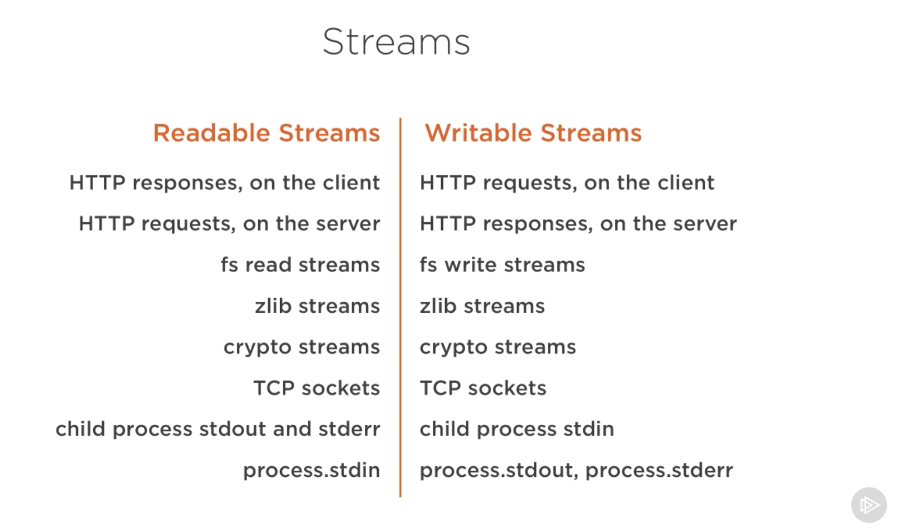
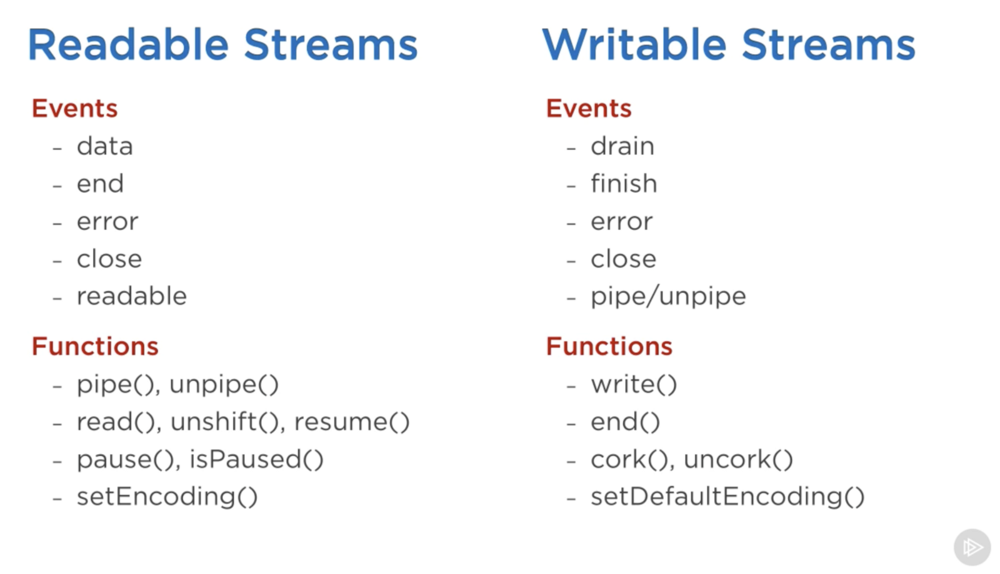
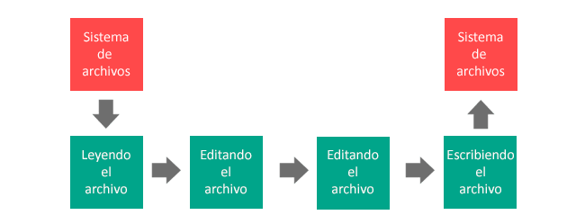

# Clase 6

### Streams

Los streams son collecciones/flujos de datos — algo parecido a los `Arrays` o los `Strings`.
La diferencia es que los datos del stream pueden no estar siempre disponibles, y pueden "contener" más datos que el límite de la memoria.

Una de las propiedades más importantes es el **encadenamiento**, podemos modificar los datos iniciales como si fuésemos encadenando comando de bash:

```bash
$ echo "Hola" | grep "o"
```

**Ejemplos de streams en Node.js**:



#### Tipos de streams

- `Readable` (lectura): Es una abstracción de un conjunto de datos de entrada, por ejemplo `fs.createReadStream()`.
- `Writable` (escritura): Es una abstracción del destino en el que será escrito, por ejemplo `fs.createWriteStream()`.
- `Duplex` (lectura y escritura): Por ejemplo un socket TCP.
- `Transform`: Un stream que a parte de leer y escribir va transformando los datos a medida que van llegando, por ejemplo `zlib.createGzip()`.

> Todos los streams son instancias de `EventEmitter`, emiten eventos a medida que leen y escriben datos.
> Sin embargo, podemos consumir y encadenar streams de una manera sencilla utilizando la función `pipe()`.

#### La función `pipe()`

```javascript
readableSrc
  .pipe(transformStream1)
  .pipe(transformStream2)
  .pipe(finalWrtitableDest)
```

La función `pipe()` devuelve la salida del stream anterior:

```javascript
a.pipe(b).pipe(c).pipe(d)

// Es equivalente a:
a.pipe(b);
b.pipe(c);
c.pipe(d);

// En Linux, es equivalente a:
$ a | b | c | d
```

#### Eventos

Los eventos más importantes de un stream de lectura son:

- `data`: Cada vez que se procesa un trozo del dato.
- `end`: Cuando ya se han emitido la totalidad de los datos.

Los eventos más importantes de un stream de escritura son:
- `drain`: Cuando el stream está disponible para recibir más datos.
- `finish`: Cuando ya se han liberado todos los datos del stream (se vacía).

```javascript
// readable.pipe(writable)

readable.on('data', (chunk) => {
  writable.write(chunk);
});

readable.on('end', () => {
  writable.end();
});
```



#### Implementando un stream de lectura y uno de escritura

```js
const { Readable, Writable } = require('stream');

const inStream = new Readable({
  read(size) {
    this.push(String.fromCharCode(this.currentCharCode++));

    if (this.currentCharCode > 90) {
      this.push(null);
    }
  }
});

const outStream = new Writable({
  write(chunk, encoding, callback) {
    console.log(chunk.toString())
    callback();
  }
});

inStream.currentCharCode = 65;

inStream.pipe(outStream);
```

#### [Más info](https://medium.freecodecamp.org/node-js-streams-everything-you-need-to-know-c9141306be93)

### Gulp 


- **Caractísticas**
  - Filosofía de código sobre configuración
  - Basado en streams
  - No es necesario usar archivos temporales

- **Instalación**
  - Instalamos Gulp global

  ```
  npm install --global gulp
  ```
  
  - Incluimos la dependencia en *package.json*

  ```
  npm install --save-dev gulp
  ```

- **Tareas por defecto**
  - Creamos `gulpfile.js` y agregamos dependencias y la primera tarea por defecto
  - Definición

  ```javascript
    const gulp = require('gulp');
    
    gulp.task('default', () => {
      console.log('Estás en la tarea por defecto!')
    });
  ```
  
  - Ejecución
  
  ```
  gulp
  ```

- **Más tareas**
  - Creamos una tarea nueva para gestionar la concatenación y minificación de los archivos js.
  - Definición

  ```javascript
  const gulp = require('gulp');
  const concat = require('gulp-concat');
  const uglify = require('gulp-uglify');
    
  gulp.task('concat-ugly', () => {
    console.log('Estas en la tarea de concatenación!')  
    gulp.src('js/sources/*.js')
      .pipe(concat('app.min.js'))
      .pipe(uglify())
      .pipe(gulp.dest('dist/js'))
  });
  ```

  - Instalamos las nuevas dependencias

  ```
  npm install --save gulp-concat
  npm install --save gulp-uglify
  ```

  - Ejecución

  ```
  gulp concat-ugly
  ```

- **Agrupando tareas**
  - Definición

  ```javascript
  gulp.task('build', ['images', 'css', 'js']);
  ```

  - Lanzamiento

  ```
  gulp build
  ```


- **Concatenando tareas**
  - Definición

  ```javascript
  gulp.task('css-paso-2', ['css-paso-1'], function(
    console.log('css-paso-2 empieza solo cuando... css-paso-1 haya termiando!')
  ));
  ```

  - Lanzamiento

  ```
  gulp css-paso-2
  ```

- **[Ejemplo de gulpfile.js](https://gist.github.com/torgeir/8507130)**


**Entendiendo Gulp**
- gulp.src() y gulp.dest()
  - Un solo archivo

    ```javascript
    gulp.src('client/templates/index.jade')
        .pipe(gulp.dest('output/dir'));
    ```

  - Múltiples archivos

    ```javascript
    gulp.src(['client/*.js', '!client/b*.js', 'client/bad.js'])
    // .pipe(...)
    ```

  - Múltiples archivos y carpetas

    ```javascript
    gulp.src('client/templates/**/*.jade')
    // .pipe(...)
    ``` 

  - Exclusión

    ```javascript
    !js/secreto-config.js
    ```

  - Especificando la extensión

    ```javascript
    publico/*.+(js|css)
    ```

  - [Más opciones](https://github.com/isaacs/minimatch)
- gulp.watch()
  - Monitoriza de manera activa uno o varios archivos y dispara tareas específicas cuando se hayan modificado

    ```javascript
    gulp.watch('js/source/*.js', ['js']);
    ```

**[Plugins](http://gulpjs.com/plugins/)**
- [gulp-concat](https://github.com/contra/gulp-concat)
  - Concatenación de archivos 
- [gulp-uglify](https://github.com/terinjokes/gulp-uglify)
  - Comprime javascript usando [UglifyJS2](https://github.com/mishoo/UglifyJS2)
- [gulp-stylus](https://www.npmjs.com/package/gulp-stylus)
  - Compilar de .styl a .css
- [gulp-coffee](https://www.npmjs.org/package/gulp-coffee)
  - Compilar de .coffee a .js
- [gulp-jade](https://www.npmjs.org/package/gulp-jade)
  - Compilador de .jade a .html
- [gulp-if](https://www.npmjs.org/package/gulp-if)
  - Control adiccional para el flujo de subtareas
- [gulp-imagemin](https://www.npmjs.org/package/gulp-imagemin)
  - Minificación de imágenes con formato .png, .jpeg, .gif y .svg
  - [Más opciones](https://github.com/sindresorhus/gulp-imagemin#imageminoptions)
- [gulp-jshint](https://www.npmjs.com/package/gulp-jshint)
  - JSHint
- [gulp.spritesmith](https://www.npmjs.com/package/gulp.spritesmith)
  - Crea Sprites y el css adiccional en diversos formatos (.css, .json, Sass, Less)
- [gulp-zip](https://github.com/sindresorhus/gulp-zip)
  - Compresor ZIP
- [gulp-csslint](https://www.npmjs.com/package/gulp-csslint/)
  - CSS Linter
- [gulp-eslint](https://www.npmjs.com/package/gulp-eslint/)
  - [ESLint](http://eslint.org/)
- [gulp-gh-pages](https://www.npmjs.com/package/gulp-gh-pages/)
  - Gestiona la publicación en GitHub Pages
- [gulp-git](https://www.npmjs.com/package/gulp-git/)
  - Gestiona Git desde Gulp
- [gulp-htmlmin](https://www.npmjs.com/package/gulp-htmlmin/)
 - Minificador de HTML
- [gulp-iconfont](https://www.npmjs.com/package/gulp-iconfont/)
  - Creando fuentes de Iconos desde archivos vectoriales
- [gulp-jsonlint](https://www.npmjs.com/package/gulp-jsonlint)
  - Linter para json
- [gulp-markdown](https://www.npmjs.com/package/gulp-markdown/)
  - Markdown a HTML
- [gulp-sourcemaps](https://www.npmjs.com/package/gulp-sourcemaps/)
  -  Crea SourceMaps
- [gulp-uncss](https://www.npmjs.com/package/gulp-uncss/)
  - Elimina CSS que no se use
- [gulp-jsdoc-to-markdown](https://www.npmjs.com/package/gulp-jsdoc-to-markdown/)
  - Conversor de jsdocs a markdown
- [gulp-unzip](https://www.npmjs.com/package/gulp-unzip/)
  - Descompresor ZIP 
- [gulp-webstandards](https://www.npmjs.com/package/gulp-webstandards)
  - Verifica prefijos CSS, Versión de librerías js, dcoType, compatibildiad entre navegadores,  etc...
- [gulp-filesize](https://www.npmjs.com/package/gulp-filesize)
  - Muestra el tamaño de los archivos. 
- [gulp-grunt](https://github.com/gratimax/gulp-grunt)
  - Tareas de Grutn funcionan en Gulp
- [gulp-shell](https://github.com/sun-zheng-an/gulp-shell)
  - Manejando comandos de terminal
- [pageres](https://github.com/sindresorhus/pageres)
  - Genera pantallazos de la web en diversos tamaños 
- [PSI](https://github.com/addyosmani/psi)
  - PageSpeed Insights desde la termianl
- [gulp-tap](https://www.npmjs.com/package/gulp-tap)
  - Callback para procesar por separado cada fichero del stream

**Grunt vs. Gulp**

  

Grunt:


Gulp:



### Ejercicios

**1 -** Partiendo del repositorio [gulp-example-spa#template](https://github.com/josex2r/gulp-example-spa/tree/template) completar el fichero `gulpfile.js` para construir la **Single Page Application**:

- **[Solución](https://github.com/josex2r/gulp-example-spa)**
