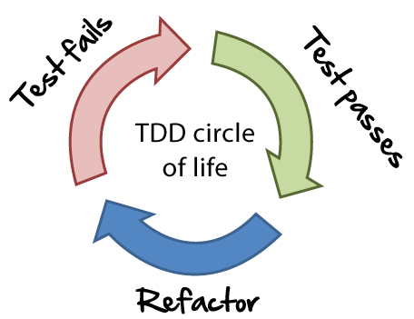
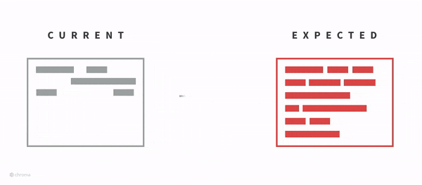
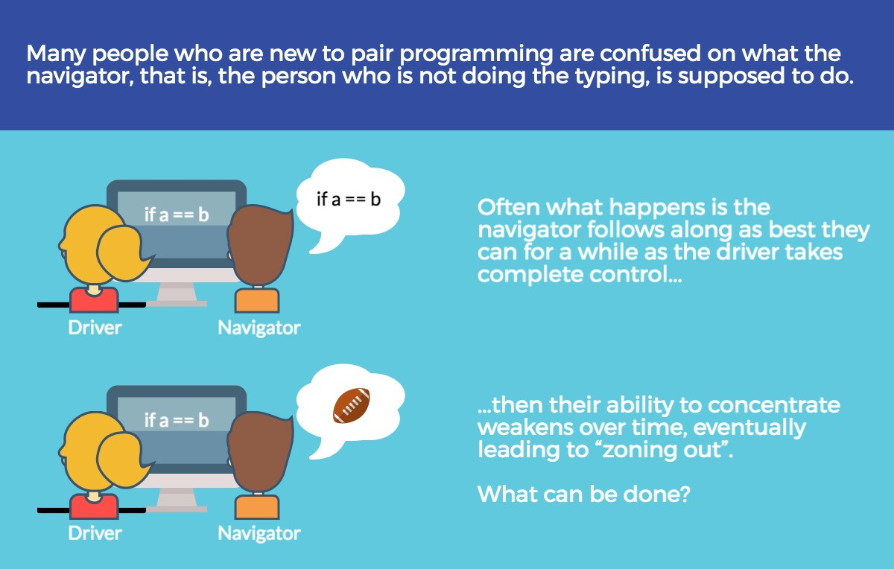
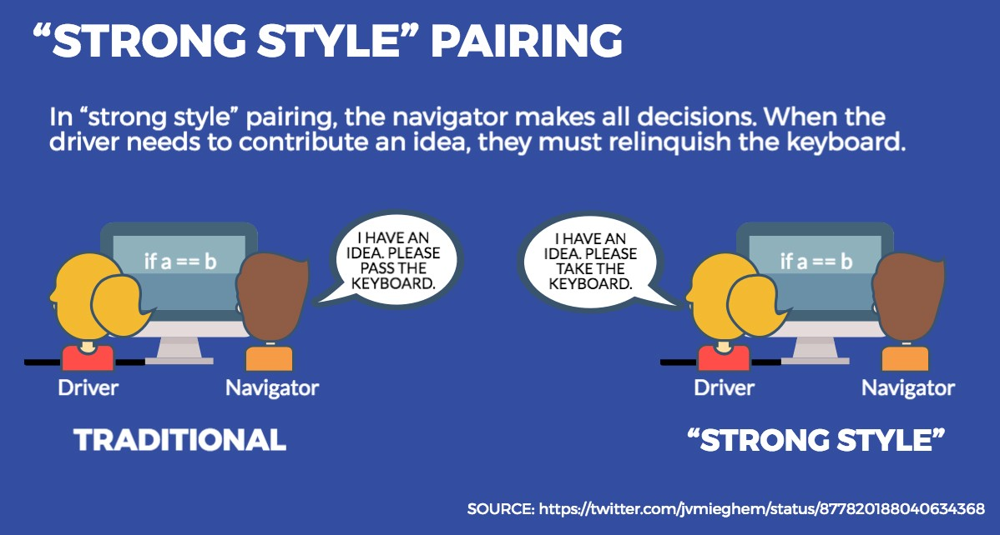
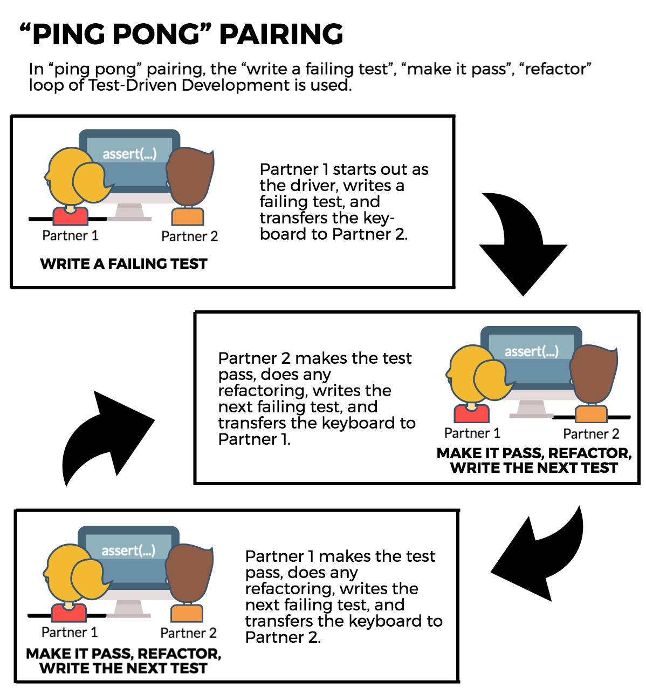
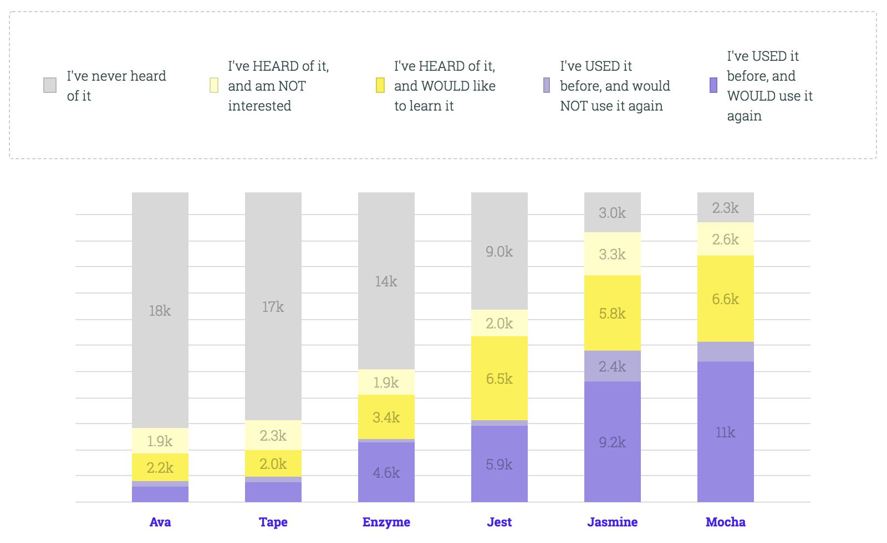
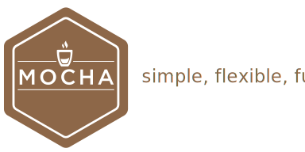

# Clase 7

### Testing Unitario

> Una prueba unitaria es una forma de comprobar el correcto funcionamiento de una unidad de código.

Esto sirve para asegurar que cada unidad funcione correctamente y eficientemente por separado.

Además de verificar que el código hace lo que tiene que hacer, comprobamos:
- Que sea correcto el nombre
- Parámetros
- Tipo de lo que se devuelve
- Entrada/Salida
- ...

La idea es escribir casos de prueba para cada función no trivial o método en el módulo, de forma que cada caso sea independiente del resto.
Luego, con las **Pruebas de Integración**, se podrá asegurar el correcto funcionamiento del sistema o subsistema en cuestión.

### TDD

> Desarrollo guiado por pruebas de software, o Test-driven development (TDD) es una práctica de ingeniería de software que involucra otras dos prácticas: Escribir las pruebas primero (Test First Development) y Refactorización (Refactoring).
En primer lugar, se escribe una prueba y se verifica que las pruebas fallan. A continuación, se implementa el código que hace que la prueba pase satisfactoriamente y seguidamente se refactoriza el código escrito.



- Primero los test
- Depués el código (Refactorización <-> Testing)

**Ciclo de Vida**:
1. Escribe los tests
1. Ejecuta y comprueba que fallan
1. Escribe el código para que pasen los tests.
1. Ejecuta los tests
1. Refactoriza
1. Repite



### Pair programming


> La técnica del pair programming consiste en codificar en pareja sobre el mismo código.

**Cada participante tiene un rol**:
- `Navigator`: Es la persona encargada de marcar el ritmo y dirigir el desarrollo. Solo puede hablar.
- `Driver`: Es el encargado de escribir el código, únicamente él puede tocar el teclado.

**Técnicas**:
- `Driver-Navigator`: Es la técnica clásica, el `driver` va escribiendo mientras el `navigator` dirige y le va diciendo qué es lo que tiene que hacer.

  

- `Strong Style`: Es muy parecida a la anterior, pero ada vez que alguien quiera opinar o dirigir tiene que pasarle el teclado a la otra persona.

  

- `Ping Pong`: Ahora hay que aplicar TDD en estado puro. Uno de los dos implementa un test y le pasa el teclado a la otra persona para que lo resuelva. Una vez resuelte escribe un nuevo test y vuelve a pasar el teclado. Así sucesivamente...

  

### Algunos datos recientes



### Combo Breaker


**Mocha + Chai + Node.js** ([unit testing + TDD in Node.js](https://www.codementor.io/davidtang/unit-testing-and-tdd-in-node-js-part-1-8t714s877))

#### Mocha



Mocha es un framework de testing para JavaScript que funciona sobre Node.js y/o en el navegador. Los tests de Mocha se ejecutan en serie, permitiendo obtener un reporte completo y sencillo.

**Primeros pasos**:
- [Browser](https://mochajs.org/#running-mocha-in-the-browser)
- [Node.js](https://mochajs.org/#installation)

**Instalación en Node.js**:

```
$ npm install --save-dev mocha
```

**Ejecutar tests en un directorio**:

```
$ mocha tests/*.js
```

**Utilizando babel**:

```
$ mocha --compilers js:babel-core/register -r babel-polyfill tests/*.js
```

**Definiendo tests**:

- `describe`: Sirve para agrupar tests, podríamos decir que sirve para definir una suite de tests.

  ```javascript
  describe('Array', () => {
    // Test code
  });
  ```

- `it`: Define un test

  ```javascript
  it('receives two params', () => {
    // Test code
  });
  ```

  ```javascript
  it('receives two params', (callback) => {
    // Async test code
    callback();
  });
  ```

- `before`: Se ejecuta una única vez antes de empezar la suite (puede agruparse dentro de un `describe`)

  ```javascript
  before(() => {
    // Prepare the suite
  });
  ```

- `after`: Se ejecuta una única vez después de terminar la suite (puede agruparse dentro de un `describe`)

  ```javascript
  after(() => {
    // Suite teardown
  });
  ```

- `beforeEach`: Se ejecuta antes de empezar cada test (puede agruparse dentro de un `describe`)

  ```javascript
  beforeEach('Array', () => {
    // Prepare the test
  });
  ```

- `afterEach`: Se jecuta después de terminar cada test (puede agruparse dentro de un `describe`)

  ```javascript
  afterEach('Array', () => {
    // Test teardown
  });
  ```

[Explain Mocha's testing framework - describe(), it() and before()/etc hooks](https://gist.github.com/samwize/8877226)

#### Chai


Chai es una librería de aserciones, similar al [assert de Node.js](https://nodejs.org/api/assert.html).
Simplifica el test proporcionando muchas aserciones con las que probar el código.

[Chai API](http://chaijs.com/api/)

**Utilizando `expect/should`**:

[API](http://www.chaijs.com/api/bdd/)

```javascript
const expect = require('chai').expect;
const myFuntion = require('./my-function');

it('returns a String', () => {
  const result = myFuntion();

  expect(result).to.be.a('string');
});
```

**Utilizando `assert`**:

[API](http://www.chaijs.com/api/assert/)

```javascript
const assert = require('chai').assert;
const myFuntion = require('./my-function');

it('returns a String', () => {
  const result = myFuntion();

  assert.typeOf(result, 'string', 'we have a string');
});
```

### Fakes (mock, spies, stub)

### Sinon.js


> Sinon.js es una librería totalmente agnóstica de cualquier framework de testign que permite crear **spies**, **stubs** y **mocks**.

**[Sinon + Chai](https://github.com/domenic/sinon-chai)**

#### Spies

Un **spy** es un objeto que escucha las interacciones con otro objeto.
Mediante el uso de espías podemos comprobar si se ha llamado a una determinada función,
los parámetros que le han llegado e incluso qué ha devuelto.

```javascript
it('calls the callback when file is readed', () => {
  const mySpy = sinon.spy();
  
  return readFilePromise('file.txt', 'utf-8')
    .then(spy)
    .then(() => {
      // Comprobamos que se haya llamado
      mySpy.should.have.been.called;
      // Comprobamos que se haya llamado con un parámetro (el fichero)
      expect(spy.getCall(0).args).to.have.lengthOf(1);
  });
});
```

#### Stubs

Un **stub** es un objeto con un comportamiento preprogramado.
A parte de realizar todo lo que hace un **spy** puede sobreescribir el comportamiento de una función.

```javascript
const fs = require('fs');

function readFile(name) {
  return fs.readFileSync(name, 'utf-8');
}

it('calls the callback when file is readed', () => {
  const fileContent = 'foo';
  sinon.stub(fs, 'readFileSync').returns(fileContent);
  
  const result = readFile('file.txt');

  expect(result).to.be.equal(fileContent);
});
```

### Ejercicios

[**Solución de los ejecicios**](https://github.com/josex2r/mocha-example)

**1 -** Inicializa un repositorio utilizando **npm** y **git**.
Deberás preparar un entorno básico de testing siguiendo los siguientes patrones:
- Crea un directorio `lib/` donde irá el código de tu proyecto.
- Crea un directorio `tests/` donde irán las pruebas unitarias.
- En el `package.json` se debe crear el script `test` para que se ejecuten los tests del proyecto.
- Cuando ejecutes los tests (utilizando `mocha + chai`) se deben ejecutar todos los ficheros en el directorio `tests/`.

**2 -** Aplicando **TDD** y utilizando el repositorio del ejercicio anterior, crea una función `atm` que devuelva el número más eficiente de billetes dados los siguientes casos:
- Si un valor no es válido (ej. negativo) no debe devolver nada.
- La función debe devolver billetes de entre 5 y 50€.

**Ejemplo** (5€)
  - 1 billete de 5€.

**Ejemplo** (35€)
  - 1 billete de 5€.
  - 1 billete de 10€.
  - 1 billetes de 20€.

**Ejemplo** (165€)
  - 1 billete de 5€.
  - 1 billete de 10€.
  - 3 billetes de 50€.

**3 -** Testea la siguiente función utilizando `sinon.js` y [sinon-chai](https://github.com/domenic/sinon-chai):

```javascript
function getFilm(id, adapter) {
  const url = `https://ghibliapi.herokuapp.com/films/${id}`;
  
  if (!id) {
    throw new Error('ID not exists');
  }

  return adapter(url).then((json) => {
    return json.title;
  });
}
```
