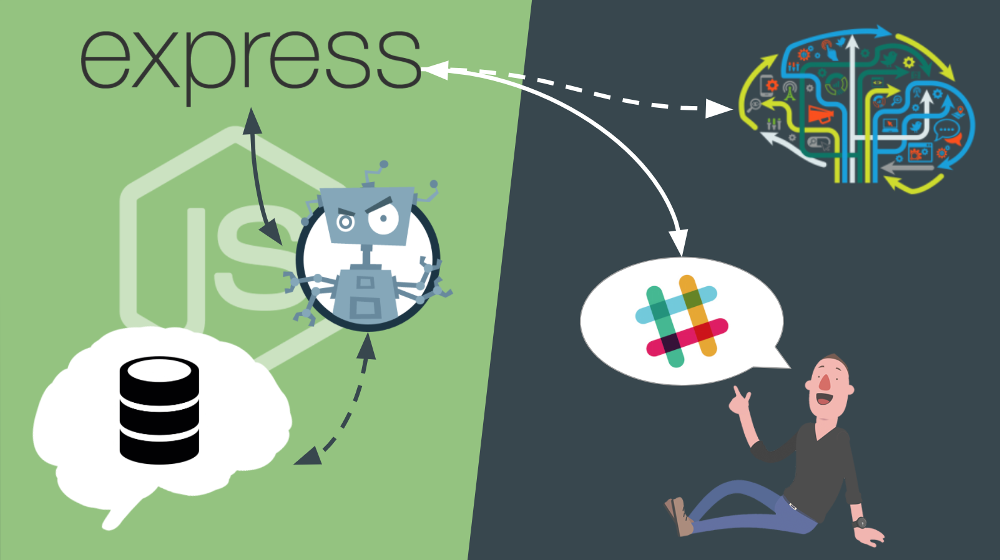

# Clase 8

### Bots vs Chat Bots

> Un bot es un programa informático que efectúa automáticamente tareas repetitivas a través de Internet, cuya realización por parte de una persona sería imposible o muy tediosa.

> Un bot de charla o bot conversacional es un programa que simula mantener una conversación con una persona al proveer respuestas automáticas a entradas hechas por el usuario.


### Frameworks

- [Hubot](https://hubot.github.com/)
- [Botkit](https://www.botkit.ai/)
- [Microsoft Bot Framework](https://tutorials.botsfloor.com/lets-make-a-chatbot-microsoft-bot-framework-node-js-7da211149c2f)

### Hubot


**Ventajas**:
- Adaptadores para las diferentes plataformas
- Made by GitHub
- Documentación completa
- Entorno de desarrollo local
- Starter kits
- Comunidad activa

**Desventajas**:
- CoffeScript (opcional)
- API básica

#### Getting Started

- Instalación de la template [generator-hubot](https://github.com/hubotio/generator-hubot):

  ```
  npm install -g yo generator-hubot
  ```

- Creación de un proyecto:

  ```
  mkdir myhubot
  cd myhubot
  yo hubot
  ```

- Inicializar el reposito git:

  ```
  git init
  git add .
  git commit -m "Initial commit"
  ```

  **Importante!!!!**
  Por defecto hubot viene instalado con [redis](https://redis.io/), por lo que si no queremos configurarla debemos deshabilitarla eliminando el paquete del fichero `external-scripts.json`.

- ¿Cómo arrancarlo?

  ```
  # Por defecto en modo shell
  bin/hubot
  # Utilizando el adaptador de Slack
  bin/hubot --adapter slack
  ```

#### [Adapters](https://hubot.github.com/docs/adapters/)


- [Shell](https://hubot.github.com/docs/adapters/shell/): Es el adaptador por defecto (desarrollo)
- [Campfire](https://hubot.github.com/docs/adapters/campfire/)
- [Gitter](https://github.com/huafu/hubot-gitter2)
- [HipChat](https://github.com/hipchat/hubot-hipchat)
- [IRC](https://github.com/nandub/hubot-irc)
- [Rocket.Chat](https://github.com/RocketChat/hubot-rocketchat)
- [Slack](https://github.com/slackapi/hubot-slack)
- [XMPP](https://github.com/markstory/hubot-xmpp)

#### Scripts

Los **scripts** no son más que plugins que nos ayudan a dotar de funcionalidad a nuestro chatbot.

Para dotar de funcionalidad al bot solo es necesario crear ficheros `*.js` en el directorio `scripts/` y automáticamente **Hubot** leerá todo lo que tengamos escrito en ese directorio.

```js
module.exports = (robot) => {
  // your code here
};
```

- Escuchando mensajes que coincidan con una expresión regular:

  ```js
  module.exports = (robot) => {
    robot.hear(/hi/i, (res) => {
      // your code
    });
  };
  ```

- Respondiendo a eventos (mensaje directo, mención o comando):
  - `my-bot how are you?`
  - `my-bot: how are you?`
  - `@my-bot how are you?`
  - `/my-bot how are you?`

  ```js
  module.exports = (robot) => {
    robot.respond(/how are you?/i, (res) => {
      // your code
    });
  };
  ```

- Respondiendo (`send` + `reply`):

  ```js
  module.exports = (robot) => {
    robot.hear(/hi/i, (res) => {
      res.send('Hello!');
    });
    
    robot.respond(/how are you?/i, (res) => {
      res.reply('I\'m fine!');
    });
  };
  ```
  
- Mensajes directos:

  ```js
  module.exports = (robot) => {
    // Enviar mensaje a una sala/usuario
    robot.messageRoom('nombre_sala_o_canal', 'mensaje');
    
    // Responder mediante un mensaje privado
    robot.hear(/hi/i, (res) => {
      robot.messageRoom(res.envelope.user.name, 'Shhh! This message is a secret');
    });
  };
  ```

- Capturando datos del mensaje:

  ```js
  module.exports = (robot) => {
    robot.respond(/show me (\d) films/i, (res) => {
      const amount = res.match[1];
      // your code
    });
  };
  ```

- Entrada/salida de usuarios en una sala:

  ```js
  const enterReplies = ['Hi', 'Target Acquired', 'Firing', 'Hello friend.', 'Gotcha', 'I see you'];
  const leaveReplies = ['Are you still there?', 'Target lost', 'Searching'];

  module.exports = (robot) => {
    robot.enter((res) => {
      res.send(res.random(enterReplies));
    });
    robot.leave((res) => {
      res.send(res.random(leaveReplies));
    });
  ```

- Manejo de errores:

  ```js
  module.exports = (robot) => {
    robot.error((error, res) => {
      robot.logger.error('DOES NOT COMPUTE');
      
      if (res) {
        res.send(error.message);
      }
    });
  ```

- Persistencia de datos (cerebro):

  Por defecto el almacenamiento será en memoria, a no ser que utilicemos algún **script** como:
  - [hubot-firebase-brain](https://github.com/justmiles/hubot-firebase-brain)
  - [hubot-mysql-brain](https://github.com/chickenzord/hubot-mysql-brain)
  - [hubot-redis-brain](https://github.com/hubotio/hubot-redis-brain)
  - ...

  ```js
  module.exports = (robot) => {
    // Leer variable
    robot.brain.get('foo');
    // Guardar variable
    robot.brain.set('foo', 'bar');
  });
  ```
  
  A parte del `get` y del `set`, disponemos de otros métodos que nos permiten obtener los datos de un determinado usuario:
  
  ```js
  module.exports = (robot) => {
    user = robot.brain.userForId(id);
    user = robot.brain.userForName(name);
    user = robot.brain.userForFuzzyName(name);
    user = robot.brain.usersForFuzzyName(name);
  });
  ```

- [Más funcionalidad en la documentación](https://hubot.github.com/docs/scripting/).

##### Añadiendo scripts externos

Para añadirlos únicamente es necesario instalarlos localmente ejecutando `npm install --save <package-name>` y después añadirlos al fichero `external-scripts.json`.

[**Ver listado completo de scripts en npm**](https://www.npmjs.com/browse/keyword/hubot-scripts)

#### Arquitectura de un bot



#### Despliegue en Heroku

1. Instala el [**kit de herramientas de Heroku**](https://devcenter.heroku.com/articles/heroku-cli).
2. Inicia sesión (`heroku login`).
3. Crea una nueva aplicación de Heroku (`heroku create`).
4. Dependiendo de los **scripts** que hayas instalado necesitarás añadir las correspondientes variables de entorno (`heroku config:set VAR_NAME=VAR_VALUE`).
5. Comitea los cambios en tu aplicación y súbelos a Heroku (`git push heroku master`).
6. Comprueba que ha ido todo correctamente visualizando los logs (`heroku logs`).

> Recuerda que si utilizas **redis** tienes que habilitarlo en Heroku (`heroku addons:create rediscloud`).

### Ejercicios

[**Solución**](https://github.com/josex2r/hubot-example)

**1 -** Crea un bot capaz de:
- Escuchar la palaba `ghibli` y responder con los comandos que es capaz de hacer.
- Responder a los siguientes comandos utilizando la [API de Ghibli](https://ghibliapi.herokuapp.com):
  - `listado de películas`: Recuperar el listado completo y mostrarlo.
  - `<n> <últimas|primeras> películas`: Recuperar las últimas/primeras `n` (número del 0 al 9) películas.
  - `detalle de la película <id>`: Recuperar el detalle de una película dada su ID.
